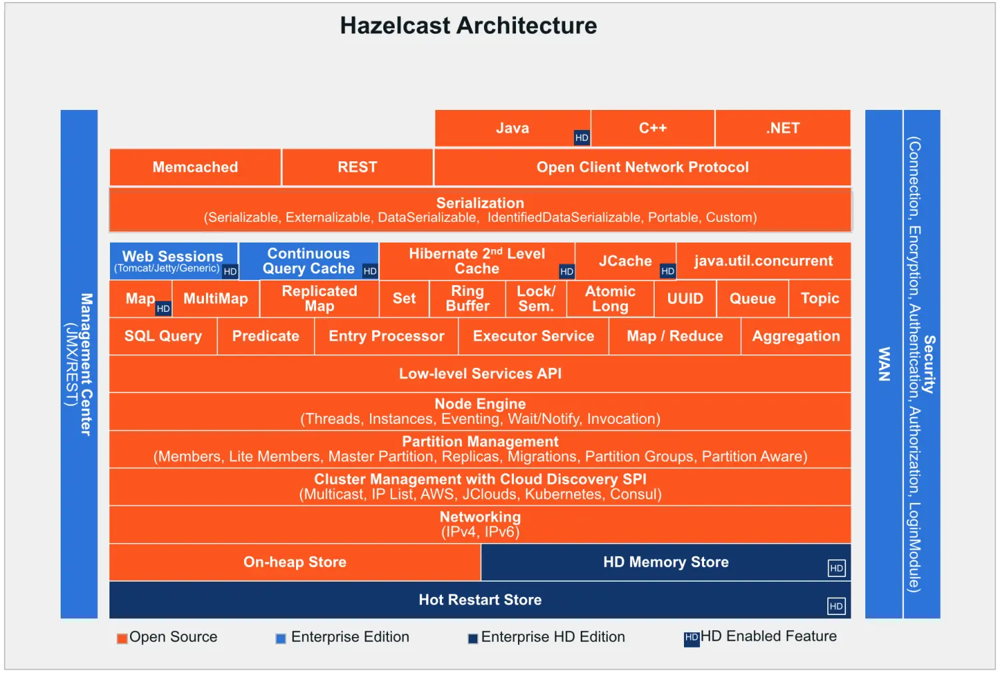
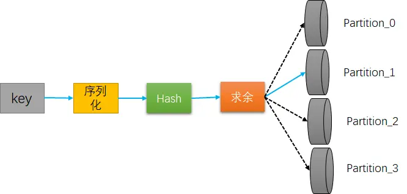
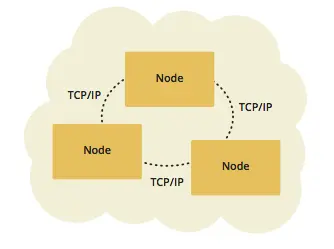
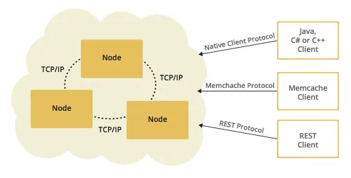
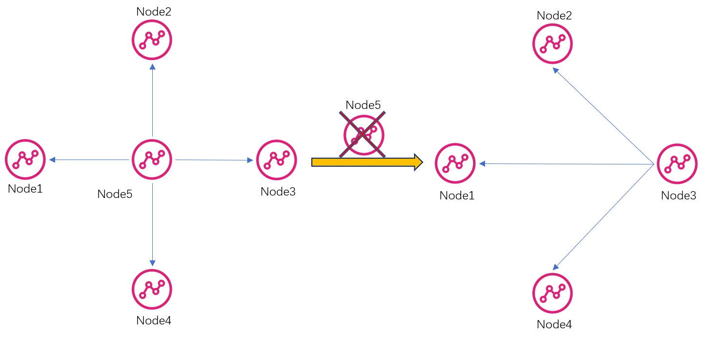
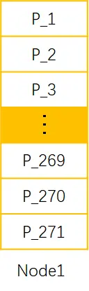
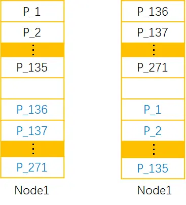
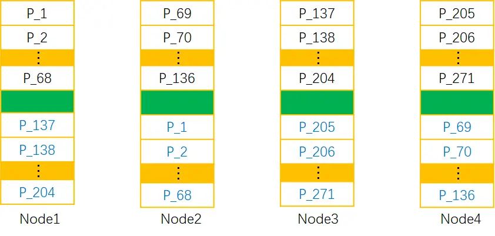

@[TOC]

- [简书-Hazelcast 概览](https://www.jianshu.com/p/99d98acb3195)
- [官方文档](https://docs.hazelcast.com/hazelcast/latest/getting-started/install-hazelcast)
- [SpringBoot内嵌Hazelcast](https://www.jianshu.com/p/913f35f41f31)
- [C/S模式教程](https://blog.csdn.net/DreamsArchitects/article/details/126471084)

# 1. Hazelcast 概览

声明:

本系列文章为学习[Hazelcast](https://docs.hazelcast.com/hazelcast/latest/getting-started/install-hazelcast)
的笔记，内容大部分都为官方文档翻译，如果对Hazelcast感兴趣，可移步Hazelcast查看官方原版文档。

学习目的:

公司项目服务化改造后，缺少一种在微服务多个实例间广播、多播的机制，为了解决这个问题决定引入 Vert.x Event Bus(cluster)
来实现，在学习使用Event Bus的过程中了解到 Event Bus 的默认 ClusterManager 基于 Hazelcast 项目，简单看了一下感觉还不错，决定整体学习一遍扩展视野。

## 1.1 Hazelcast是什么

Hazelcast是基于内存的数据网格开源项目，同时也是该公司的名称。Hazelcast提供弹性可扩展的分布式内存计算，Hazelcast被公认是提高应用程序性能和扩展性最好的方案。Hazelcast通过开放源码的方式提供以上服务。更重要的是，Hazelcast通过提供对开发者友好的Map、Queue、ExecutorService、Lock和JCache接口使分布式计算变得更加简单。例如，Map接口提供了内存中的键值存储，这在开发人员友好性和开发人员生产力方面提供了NoSQL的许多优点。

除了在内存中存储数据外，Hazelcast还提供了一组方便的api来访问集群中的cpu，以获得最大的处理速度。轻量化和简单易用是Hazelcast的设计目标。Hazelcast以Jar包的方式发布，因此除Java语言外Hazelcast没有任何依赖。Hazelcast可以轻松地内嵌已有的项目或应用中，并提供分布式数据结构和分布式计算工具。

Hazelcast
具有高可扩展性和高可用性（100%可用，从不失败）。分布式应用程序可以使用Hazelcast进行分布式缓存、同步、集群、处理、发布/订阅消息等。Hazelcast基于Java实现，并提供C/C++，.NET，REST，Python、Go和Node.js客户端。Hazelcast遵守内存缓存协议，可以内嵌到Hibernate框架，并且可以和任何现有的数据库系统一起使用。Hazelcast的架构不对开发者暴露。

Hazelcast的整体架构如下：



如果你正在寻找基于内存的、高速的、可弹性扩展的、对开发者友好的NoSQL，Hazelcast是一个很棒的选择。

## 1.2 Hazelcast的特点

- **简单:**

  Hazelcast基于Java语言编写，没有任何其他依赖。Hazelcast基于熟悉的Java
  util包对外暴露相同的API和接口。只要将Hazelcast的jar包添加到classpath中，便可以快速使用JVM集群，并开始构建可扩展的应用程序。

- **节点对等，没有主从:**

  和大多数NoSQL解决方案不同，Hazelcast集群中的节点是对等的，集群中没有主备角色之分，因此Hazelcast无单点故障问题。集群内所有节点存储和计算同量数据。可以把Hazelcast内嵌到已有的应用程序中或使用客户端服务器模式（应用程序作为Hazelcast集群中一个节点的客户端）。

- **可扩展:**

  Hazelcast被设计为可以扩展到成百上千个节点，简单的增加节点，新加入的节点可以自动发现集群，集群的内存存储能力和计算能力可以维持线性增加。集群内每两个节点之间都有一条TCP连接，所有的交互都通过该TCP连接。

- **快、快、快:**

  所有数据都存储在内存中，Hazelcast支持快速写和更新操作。

> - 开源。
> - 基于Jar发布，无需安装软件。
> - 不对用户暴露Hazelcast的架构。
> - 提供开箱即用的分布式数据结构。
> - 无单点故障。
> - 支持动态弹性扩展。
> - 数据备份，节点故障数据无丢失。
> - 集群内节点彼此感知。
> - 使用SPI可以构建自己的分布式数据结构。
> - 拥有一个活跃的开源社区。

## 1.3 Hazelcast中的分片

Hazelcast中的分片也称为分区，Hazelcast默认271个分区。Hazlecast通常也会对分区备份，并将副本分布到集群的不同节点上，通过数据冗余提高可靠性，这种数据的存储方式和kafka、Redis
Cluster类似。给定一个key，在Hazelcast集群中查找key对应数据的过程如下图所示：



## 1.4 Hazelcast的拓扑结构

Hazelcast集群有两种部署模式：内嵌模式、客户端/服务器模式。

### 1.4.1 内嵌模式

如果应用程序的主要关注点是: 异步、高性能计算，和执行大量任务，那么使用内嵌部署模式比较合适。

在内嵌部署模式下，Hazelcast集群中的一个节点包括：应用程序，Hazelcast分区数据，Hazelcast服务三部分。

内嵌部署模式的优势是读取数据延迟低。内嵌部署模式如下图所示：



### 1.4.2 C/S模式

Hazelcast数据和服务集中在一个或多个节点上，应用通过客户端读写数据。

可以部署一个提供服务的独立Hazelcast集群，服务集群可以独立创建，独立扩展。

客户端通过和集群中的节点交互来获取Hazelcast数据和服务。Hazelcast提供Java，.NET、C++、Memcache和REST客户端。客户端/服务器部署模式如下图所示：



客户端/服务器部署模式的优点包括：可预测性高、可靠的Hazelcast服务、问题定位定界简单，更重要的是具备高可扩展性。

在客户端/服务器模式下，当集群需要扩展时，只需添加或减少Hazelcast服务器节点。客户端和服务器的伸缩可以独立进行。

如果既想拥有低延迟数据访问（内嵌部署模式），又想充分利用客户端/服务器模式的灵活扩展性，需要考虑将客户端部署在更靠近缓存的地方，并将客户端的热点数据缓存到客户端本地缓存中。

## 1.5 一致性解决方案

为了提高灵活性和性能，Hazelcast在集群周围共享数据。Hazelcast基于内存的数据网格为分布式数据提供集群和高可扩展性。

集群无主节点是Hazelcast的一个主要特性，从功能上来讲，集群内每个节点都被配置为对等。第一个加入集群的节点负责管理集群内其他所有节点，例如数据自动平衡、分区表更新广播。如果第一个节点下线，第二个加入集群的节点负责管理集群其他节点。第一个节点故障切换方式如下图所示：



数据完全基于内存存储、访问速度快是Hazelcast的另外一个特点。由于Hazelcast将数据的副本分布到集群中的其他节点上，所以在故障条件下（节点宕机）也不会有数据丢失。Hazelcast提供很多分布式数据结构和分布式计算工具，增强分布式集群内存的访问并通过CPU最大化分布式计算的速度。

## 1.6 数据分区

Hazelcast中的分片也叫做分区，分区是一个内存段，分区中存储数百或数千数据实体，分区的存储容量取决于节点自身的存储能力。

Hazelcast默认提供271个分区，类似Redis拥有16384个槽位。当启动只有一个节点的Hazelcast集群时，节点拥有全部271个分区。Hazelcast集群只有一个节点的条件下的分区分布如下图所示：



Hazelcast集群新增加一个节点，或启动一个包含两个节点的Hazelcast集群，分区的分布情况如下图所示：



> 黑色字体表示的分区为 主分区，蓝色字体表示 主分区的副本。

不断加入新的节点，Hazelcast会一个一个的把主分区和主分区副本迁移到新加入的节点上，保证主备分区的一致性和冗余性。当集群有四个节点时，
集群分区的一种可能方案如下：



Hazelcast将分区均匀的分布到集群的各个节点，Hazelcast自动创建分区的副本，并将副本分布到各个节点来提供可靠性。

以上图片展示的Hazelcast分区仅仅是为了方便和清晰的描述Hazelcast分区机制。通常来说分区的分布不是有序的，Hazelcast使用一种随机的方式分布各个分区。这里重点说明Hazelcast均匀的分布分区和分区副本。

Hazelcast
3.6版本引入轻量化节点（存储轻量化节点），轻量化节点是一种新的节点类型，轻量化节点不持有任何分区数据。轻量化节点主要用于计算型任务和监听器注册，尽管轻量化节点不保存分区数据，但是轻量化节点可以访问集群中其他节点所持有的分区数据。

### 1.6.1 数据如何被分区

Hazelcast使用一种哈希算法将数据分布到特定分区。给定一个key，分区计算过程如下：

1. 将key序列化为byte数组。
2. 计算byte数组的哈希值。
3. 哈希值与分区数求余,得到分区ID（注意不是节点数）。

> 同一个key的分区ID必须保持一致。

### 1.6.2 分区表

- 启动集群内的一个节点时，该节点会自动创建一个分区表。
- 分区表存储分区ID和集群内其他的节点信息。
- 分区表的主要目的是让集群内的所有节点（包括轻量节点）了解分区信息，确保每个节点都知道数据存储在哪个分区，哪个节点上。
- 最早加入集群的节点周期性的向集群内其他节点发送分区表。 通过这种方式，当分区关系发生变化时，集群内的所有节点都可以感知该变化。
- 当一个节点加入或离开集群时，分区关系就会发生变化。
- 当集群内最早加入的节点故障时，剩余节点中最早加入集群的节点负责周期性的向其他节点发送分区表。
  -发送分区表的周期默认是15S，如果想修改周期，可以通过设置环境变量 hazelcast.partition.table.send.interval 来进行修改。

### 1.6.3 重分区

重分区是 Hazelcast 重新分配分区关系的过程，以下两种情况会触发Hazelcast执行重分区动作。

- 一个节点加入集群.
- 一个节点离开集群.

在这种情况下，最早加入集群的节点会更新分区关系表，并将更新后的分区表发送给集群内其他节点。

轻量节点加入集群不会触发重分区动作，因为轻量节点主要执行计算任务，本身不保存任何分区数据。

## 1.7 使用场景

- 共享服务器配置和服务器信息;
- 集群数据变更通知;
- 作为简单的内存缓存;
- 作为一个在特定节点执行特定任务的调度器;
- OSGI框架下不同节点共享信息;
- 集群内共享数千个key;
- 作为Cassadra的前端;
- 集群内分发用户状态，不同对象间传递信息，共享系统数据结构;
- 多租户缓存，每个租户都有自己独立的缓存;
- 共享数据集合;
- 从亚马逊EC2分发和收集服务负载信息;
- 作为性能检测的实时流;
- Session存储器;

# 2. Hazelcast 集群

## 2.1 集群发现机制

Hazelcast集群是一个由运行Hazelcast实例构成的网络，成员自动加入集群，过程依赖于集群发现机制。当Hazelcast集群建立完成，集群间成员使用TCP/IP互相通信，这不受集群发现机制的约束。Hazelcast支持以下发现机制：

- TCP
- Zookeeper
- Etcd
- Eureka
- Kubernetes
- Consul
- 多播:
    - 多播使用UDP协议，在生产环境中，UDP经常被禁止使用，因此不推荐。
- GCP Cloud Discovery
- AWS Cloud Discovery
- Apache jclouds Cloud Discovery
- Azure Cloud Discovery
- Heroku
- PCF
- OpenShift

Hazelcast支持业界主流的集群发现机制，可以根据自己的需求和条件选择适合自己的集群发现机制。

## 2.2 TCP发现机制

Hazelcast配置成一个完整的TPC/IP集群（发现和通信都使用TCP/IP协议）。使用TCP/IP配置Hazelcast集群成员发现时，需要列出全部或部分成员的主机名或IP地址。无需列出所有集群成员，但是当新成员加入时，至少有一个列出的成员必须在集群中处于活跃状态。

使用xml配置TPC/IP发现的简单配置如下：

```xml

<hazelcast>
    ...
    <network>
        <join>
            <multicast enabled="false"/>
            <tcp-ip enabled="true">
                <member>machine1</member>
                <member>machine2</member>
                <member>machine3:5799</member>
                <member>192.168.1.0-7</member>
                <member>192.168.1.21</member>
            </tcp-ip>
        </join>
    </network>
    ...
</hazelcast>
```

> - member 可以配置主机名 和IP，也可以配置IP地址范围；
> - 如果member是多个IP地址可以使用members简化配置：<members>192.168.1.0-7,192.168.1.21</members>
> - 如果没有提供端口，Hazelcast会从5701、5702等尝试
> - 默认 Hazelcast 绑定所有的网络接口来接收流量，但是可以通过设置 hazelcast.socket.bind.any=false 来改变，并通过 interface
    来决定绑定的网络接口，如果没有配置 interface 的值， Hazelcast 会选择一个网络接口绑定。

Hazelcast同时还支持以yaml的方式进行所有的配置，上面xml等效的yaml配置如下：

```yaml
hazelcast:
  network:
    join:
      multicast:
        enabled: false
        multicast-group: 224.2.2.3
        multicast-port: 54327
      tcp-ip:
        enabled: true
        member-list:
          - machine1
          - machine2
          - machine3:5799
          - 192.168.1.0-7
          - 192.168.1.21
```

## 2.3 多播发现机制

Hazelcast允许集群成员间使用多播通信来相互发现。集群成员间不需要互相知道对方的具体地址，而只是向集群内所有监听的成员广播消息。多播是否可用或允许使用依赖于环境，使用前请谨慎确认，避免环境不允许使用而导致功能异常。

下面是使用xml配置多播发现机制的最简单配置：

```xml

<hazelcast>
    ...
    <network>
        <join>
            <multicast enabled="true">
                <multicast-group>224.2.2.3</multicast-group>
                <multicast-port>54327</multicast-port>
                <multicast-time-to-live>32</multicast-time-to-live>
                <multicast-timeout-seconds>2</multicast-timeout-seconds>
                <trusted-interfaces>
                    <interface>169.254.82.121</interface>
                </trusted-interfaces>
            </multicast>
        </join>
    </network>
    ...
</hazelcast>
```

对于参数 multicast-timeout-seconds 需要多加注意，该参数表明了一个成员等待合法的多播响应的时间，单位为s，如果在设定的时间内没有收到合法的响应，该成员就会选举自己成为leader并创建自己的集群。

该参数只适用于集群无leader而且新的成员刚启动的场景。如果参数的值设置的太大，比如60s，这意味着在选举出leader之前需要等待60s之后才能进行下一次的尝试。值设置过大和过小都需要谨慎处理，如果值设置的太小，可能导致成员过早的放弃而开始下一轮尝试。

## 2.4 发现本地客户端

使用多播插件，本地java客户端和Hazelcast成员之间可以互相发现，插件以SPI机制的方式提供。为了使用多播发现Hazelcast成员和java客户端都需要配置插件。

下面的xml提供了集群配置多播发现插件的最简单配置：

```xml

<hazelcast>
    ...
    <properties>
        <property name="hazelcast.discovery.enabled">true</property>
    </properties>
    <network>
        <join>
            <multicast enabled="false"/>
            <tcp-ip enabled="false"/>
            <discovery-strategies>
                <discovery-strategy class="com.hazelcast.spi.discovery.multicast.MulticastDiscoveryStrategy"
                                    enabled="true">
                    <properties>
                        <property name="group">224.2.2.3</property>
                        <property name="port">54327</property>
                    </properties>
                </discovery-strategy>
            </discovery-strategies>
        </join>
    </network>
    ...
</hazelcast>
```

- group 多播组
- port 多播端口

## 2.5 创建集群

通过 cluster-name 是创建集群最简单的方法，cluster-name 也是对集群隔离分组的简单方式，下面创建了一个名字为 IoT 的Hazelcast
集群：

```xml

<hazelcast>
    <cluster-name>IoT</cluster-name>
</hazelcast>
```

也可以使用编码的方式配置集群: 一个 JVM 可以运行多个 Hazelcast 实例，每个实例只能加入一个组（集群），每个实例只和所属集群的实例交互，与其他集群的实例隔离。

```
GroupConfig iotGroupConfig=new GroupConfig();
iotGroupConfig.setName("IoT");
Config iotConfig=new Config();
iotConfig.setGroupConfig(iotGroupConfig);

GroupConfig edgeGroupConfig=new GroupConfig();
edgeGroupConfig.setName("edge");
Config edgeConfig=new Config();
edgeConfig.setGroupConfig(iotGroupConfig);

HazelcastInstance instance1=Hazelcast.newHazelcastInstance(iotConfig);
HazelcastInstance instance2=Hazelcast.newHazelcastInstance(iotConfig);
HazelcastInstance instance3=Hazelcast.newHazelcastInstance(edgeConfig);
```

上面的代码创建了三个实例：instance1、instance2和instance3，其中instance1和instance属于IoT集群，instance3属于edge集群。

# 3. 分布式数据结构简介

Hazelcast 提供了很多通用数据结构的分布式实现。针对每一种不同的客户端语言，Hazelcast 都尽量模拟该语言原生接口，对于Java客户端，Hazelcast
提供的 IMap , 和 java.util.Map 有近似的语义。

为了更加直观的描述，针对 Hazelcast 中的数据结构，我们将提供 Java 中等效或类似接口。所有这些结构都可以在
Java,.NET,C++,Node.js,Python,Go和Scala客户端中使用。

**标准集合**

- Map： java.util.Map 的分布式实现。
- Queue： java.util.concurrent.BlockingQueue 的分布式实现。
- Ringbuffer：Java中没有对应的数据结构，Ringbuffer通常用于可靠的事件系统。
- Set： java.util.Set 的分布式并发实现。
- List： java.util.List 的分布式并发实现，支持存储重复元素，这是和Set的唯一区别。
- Multimap： com.google.common.collect.Multimap 的分布式实现，支持存储重复键。
- Replicated Map：不支持分区的Map数据结构，集群所有成员都有全量数据。
- Cardinality Estimator ：实现了lajolet’s HyperLogLog 算法的数据结构。

**主题**

主题是用于多个订阅者的分布式消息分发机制，和 kakfa、pulsar 中的主题一样，同样也是 pub/sub 消息模型的关键。Hazelcast
支持通过主题进行消息的可靠分发。

**并发工具**

- FencedLock：java 中 java.util.concurrent.locks.Lock 的分布式实现，可以保证集群中只有一个线程可以获得锁。
- ISemaphore：java中 java.util.concurrent.Semaphore 的分布式实现。
- IAtomicLong：java中 java.util.concurrent.atomic.AtomicLong 分布式实现。
- IAtomicReference：Java中 java.util.concurrent.atomic.AtomicReference 的分布式实现。
- FlakeIdGenerator：用于生产集群范围内的唯一标识符。
- ICountdownLatch： Java中 java.util.concurrent.CountDownLatch 的分布式实现。
- PN counter：一个分布式数据结构，其中每个 Hazelcast 实例都可以递增和递减计数器值，并将这些更新传播到所有副本。

**Event Journal**：是一种分布式数据结构，用于存储map或缓存上操作的历史记录。

## 3.1 分布式对象介绍

基于分区策略，Hazelcast有两种类型的分布式数据结构：分区数据结构和非分区数据结构，分区数据结构一个分区只保存部分数据，非分区数据结构一个分区保存全部的数据。

**分区数据结构**

Map, MultiMap, Cache, Event Journal

**非分区数据结构**

Queue, Set, List, Ringbuffer, FencedLock, ISemaphore, IAtomicLong, IAtomicReference, FlakeldGenerator, ICountdownLatch,
Cardinality Estimator, PN Counter

> 除分区和非分区数据结构以外，Hazelcast同时提供了Replicated Map（可复制集合）数据结构。

## 3.2 分布式对象的加载和销毁

针对大多数分布式对象，Hazelcast提供了获取实例的get 方法。一个分布式对象的加载，首先需要创建一个Hazelcast实例，然后通过Hazelcast实例调用对应的get
方法获取。下面的例子创建一个Hazelcast实例instance1 并在该实例上创建一个叫data的分布式Map。

```
HazelcastInstance instance1 = Hazelcast.newHazelcastInstance();
IMap<String, String> data = instance1.getMap("data");
```

Hazelcast支持对分布式对象的属性进行配置，默认使用hazelcast.xml中的配置信息，也可以在xml中显示配置或根据需求使用代码进行配置。Hazelcast中的大多数分布式对象都是懒加载，只有在第一次操作对象时才创建对象。使用已经创建的对象，可以直接通过对象的引用访问，无需重新加载一次。

销毁分布式对象可以使用destory 方法，该方法会清理和释放对象的所有资源。使用该方法时需要十分谨慎，销毁对象并创建一个新的对象赋值给原来的对象引用不会产生任何错误。下面的代码展示了这种潜在的危险。

```
HazelcastInstance instance1 = Hazelcast.newHazelcastInstance();
IMap<String, String> data = instance1.getMap("data");
data.put("hazelcast","a good tool");
System.out.println("The size of map = " + data.size());
// 销毁 对象, 缓存数据将全部清除
data.destroy();
System.out.println("The size of map = " + data.size());
```

上述代码运行没有任何错误，输出结果如下：

```
The size of map = 1
The size of map = 0
```

Hazelcast中所有的分布式数据结构都被设计为当访问对象的时刻才创建对象，因此即便已经销毁了对象，只要对该对象还有访问，对象就会被重新创建。

## 3.3 控制分区

Hazelcast使用分布式对象的名字决定该对象应该存储在哪个分区。下面创建两个Queue 对象，名字分别为q1和q2：

```
HazelcastInstance instance1 = Hazelcast.newHazelcastInstance();
IQueue<String> queue1 = instance1.getQueue("q1");
IQueue<String> queue2 = instance1.getQueue("q2");
```

由于queue1和queue2两个队列的名字不同，因此他们将会存储在不同的分区。如果想将两个队列存储在同一个分区，可以使用 @
符设置分区key，从而将两个队列存储在同一个分区：

```
HazelcastInstance instance1 = Hazelcast.newHazelcastInstance();
IQueue<String> queue1 = instance1.getQueue("q1@test");
IQueue<String> queue2 = instance1.getQueue("q2@test");
```

现在两个队列存储在同一个分区，因为它们使用相同的分区 key ：test
，Hazelcast提供了getPartitionKey方法用于获取分区key的信息，这将有助于创建一个和已有对象存储在同一个分区的新对象。

```
HazelcastInstance instance1 = Hazelcast.newHazelcastInstance();
IQueue<String> queue1 = instance1.getQueue("q1@test");
IQueue<String> queue2 = instance1.getQueue("q2@test");
System.out.println("queue1 partition key = " + queue1.getPartitionKey());
System.out.println("queue2 partition key = " + queue2.getPartitionKey());
```

上面的代码将会输出queue1和queue2的分区key：

```
queue1 partition key = test
queue2 partition key = test
```

## 3.4 公共特性

Hazelcast中所有分布式对象都具有高可用性（HA）：

- 当集群中有一个成员发生故障时，备份副本会将包括权限、锁在内的所有数据，分配给集群内其他成员，确保无数据丢失。
- 集群中所有的成员都有相同的权力和责任，没有主节点或leader，不依赖外部服务，因此没有单点故障。

## 3.5 样例

下面的代码将简单的展示如何获取已经创建的分布式对象实例以及如何监听实例事件：

```
HazelcastInstance instance = Hazelcast.newHazelcastInstance();
instance.addDistributedObjectListener(new DistributedObjectListener() {
    @Override
    public void distributedObjectCreated(DistributedObjectEvent event) {
        DistributedObject instance = event.getDistributedObject();
        System.out.println(instance.getName() + " created");
    }

    @Override
    public void distributedObjectDestroyed(DistributedObjectEvent event) {
        System.out.println(event.getObjectName() + " destroyed");
    }
});
IQueue<String> queue1 = instance.getQueue("q1");
IQueue<String> queue2 = instance.getQueue("q2");
queue1.add("hello");
queue2.add("world");
instance.getDistributedObjects().forEach(o -> System.out.println(o.getName()));
instance.getDistributedObjects().forEach(DistributedObject::destroy);
```

上面的样例代码将输出：

```
q1 created
q2 created

q1
q2

q1 destroyed
q2 destroyed
```

# 4. 分布式Map

Hazelcast的IMap 扩展了java.util.concurrent.ConcurrentMap 和java.util.Map·两个接口，是Java map的分布式实现。

## 4.1 获取Map并存储数据

调用Hazelcast实例的 getMap 方法可以获取一个分布式map，并可以通过put
方法存储数据。Hazelcast对map数据和备份数据进行分区，并将数据平均分配给集群所有的节点。每个节点存储的数量大约为Map.size()*
2/n，其中n为集群节点数量。

```
HazelcastInstance instance = Hazelcast.newHazelcastInstance();
IMap<Integer, String> fruits = instance.getMap("fruits");
fruits.put(1, "apple");
fruits.put(2, "banana");
fruits.put(3, "pear");
```

> Hazelcast默认有271个分区，但是fruits 这个map只有三条数据，因此大多数的分区中没有保存数据。

## 4.2 创建一个节点备份Map数据

当集群中节点数量大于1时，map中的数据会被自动分配给集群所有节点，每个节点存储的数据量约为 data count/n + backups。

## 4.3 Map备份

Hazelcast会把map中的数据分布在集群的多个节点上，每个节点只存储一部分数据。分布式map的默认备份数为一。如果有一个节点故障，可以使用集群中的备份数据进行恢复。Hazelcast中的map有两种类型的备份：同步和异步。

### 4.3.1 同步备份

通过设置备份数，Hazelcast提供了更高的数据安全性，集群一个节点的数据会被拷贝到其他节点。创建同步备份只需要设置backup-count ：

```xml

<hazelcast>
    ...
    <map name="fruits">
        <backup-count>1</backup-count>
    </map>
    ...
</hazelcast>
```

如果backup-count 的值为1，map的备份数据会全部存储在另外一个节点上。如果backup-count
的值为2，集群中的两个节点会存储map的备份数据。如果不希望对数据进行备份，可以设置backup-count
的值为0。如果性能的重要性超过数据的可靠性，backup-count 可设置的最大值为6。

Hazelcast同时支持同步和异步备份，默认为同步备份，并使用backup-count
参数配置。在同步备份场景下，备份操作会阻塞其他操作直到备份数据已经同步到集群节点并收到确认，因此备份会在put
操作完成前更新，从而提供了集群数据更高的可靠性。同步备份操作可能带来额外的阻塞成本并产生时延问题。

### 4.3.2 异步备份

与同步备份呢不同，异步备份不会阻塞对map的操作，异步备份不需要确认，而且备份动作在特定的时间点执行。可以通过参数asyn-backup-count
设置异步备份，下面是一个简单声明式配置：

```xml

<hazelcast>
    ...
    <map name="default">
        <backup-count>0</backup-count>
        <async-backup-count>1</async-backup-count>
    </map>
    ...
</hazelcast>
```

> - 数据备份会增加内存的使用。
> - map可以同时拥有同步备份和异步备份。

### 4.3.3 节点备份数据可读

Hazelcast默认只有一个同步备份。如果backup-count
的值大于1，那么集群中的节点需要保存属于本节点的数据和备份数据。因此，在某个节点上调用map.get(key)
方法时，该节点可能拥有该key对应的备份数据，默认map.get(key) 方法会从真正拥有该数据的节点读取数据（这点和kafka中从partition的leader读取数据类似）。

通过设置read-backup-data 为true，可以允许备份数据可读，Hazelcast从数据一致性考虑触发，将该参数的默认值为false。备份数据可读可以提高读操作性能，但是可能产生脏读问题。

设置备份可读的简单声明式配置如下：

```xml

<hazelcast>
    ...
    <map name="default">
        <backup-count>0</backup-count>
        <async-backup-count>1</async-backup-count>
        <read-backup-data>true</read-backup-data>
    </map>
    ...
</hazelcast>
```

至少有一个同步或异步备份的条件下备份数据可读这个功能才可用。如果从备份读取数据，需要考虑key命中问题，key
在备份数据中命中，可能在真正的数据成员节点不会命中。这会影响IMap统计中的最大空闲时间和过期时间。因此在备份中命中的key，在真正拥有数据的成员可能已经过期。

## 4.4 驱逐map数据

map中的数据会一直存在，除非手动删除或使用驱逐策略驱逐。IMap支持基于策略的数据驱逐，目前支持两种驱逐策略：LRU和LFU。

### 4.4.1 理解map驱逐

Hazelcast实现了基于分区的map驱逐。例如，如果PER_NODE的值为max-size，Hazelcast使用下面的公式计算每个分区的最大数据量：
partition-maximum-size = max-size * member-count / partition-count

> 如果计算出partition-maximum-size 的值小于1，partition-maximum-size 会被设置为1.

当向map中插入数据时，根据上面公式计算出的分区最大数量启动驱逐。如果该分区存储的数据量超过最大值，Hazelcast会在该分区启动驱逐。

假设map的配置信息如下：

- 分区数: 200
- 每个分区数据量: 100
- max-size (PER_NODE): 20000

map总的存储数据量为20000，也就是说驱逐的数据量阈值为20000.当向map插入数据时，驱逐的过程如下：

1. 计算插入的数据需要存储的分区位置
2. 检查分区是否达到驱逐阈值
3. 驱逐一条数据

上述驱逐过程的结果是map的大小变为19999，下一次操作不会触发新的驱逐操作直到map存储的数量再次到达驱逐阈值。

### 4.4.2 Map驱逐配置

```xml

<hazelcast>
    ...
    <map name="default">
        <time-to-live-seconds>0</time-to-live-seconds>
        <max-idle-seconds>0</max-idle-seconds>
        <eviction eviction-policy="LRU" max-size-policy="PER_NODE" size="5000"/>
    </map>
    ...
</hazelcast>
```

- **time-to-live-seconds**:
  该参数设置每条数据在map中的保存时间（TTL）。该参数限制了一条数据自最后一次被操作的存活时间，如果该参数的值不为0，数据的存活时间超过参数值时会被自动驱逐。每条数据可以设置自己的time-to-live-seconds参数，如果不设置则使用map的参数值。该参数值的取值范围为[0,Integer.MAX_VALUE]
  。默认值为0，表示数据永不过期。如果参数的值不为0，数据驱逐将不会受eviction-policy的影响。
- **max-idle-seconds**:
  该参数设置数据在map中的最大空闲时间（自最后一次操作以来的时间）数据的空闲时间超过该值时会自动被驱逐。参数取值范围[0,Integer.MAX_VALUE]
  ，默认值为0，表示无穷大，数据一直不被访问也可以保存在map中。
- **eviction-policy**: 数据量超过设置的最大值时采用的驱逐策略:
    - LRU: 最近最少使用策略.
    - LFU: 最少使用策略.
    - NONE: 默认策略，如果使用该策略，当数据量超过最大值时不会驱逐数据。可以和 time-to-live-seconds 、 max-idle-seconds
      配合使用。
- **size**:
  map存储数据的最大值。当map存储的数据量超过该参数的值时，map会基于设置的驱逐策略对数据驱逐。参数的取值范围为[0,Integer.MAX_VALUE]
  ，默认值为0，表示可以存储无穷多数据。如果希望该参数可用， eviction-policy 只能设置为LRU 或 LFU。
- **max-size-policy**: 数据存储策略。
    - **PER_NODE**: 集群节点存储的最大数据量，该策略为默认策略。  
      \<eviction max-size-policy="PER_NODE" size="5000"/>
    - **PER_PARTITION**: 每个分区存储的最大数据量。  
      \<eviction max-size-policy="PER_PARTITION" size="27100" />
    - **USED_HEAP_SIZE**: 每个Hazelcast实例使用的最大堆大小（MB）。    
      \<eviction max-size-policy="USED_HEAP_SIZE" size="4096" />
    - **USED_HEAP_PERCENTAGE**: 每个Hazelcast实例使用的堆内存大小比例。  
      \<eviction max-size-policy="USED_HEAP_PERCENTAGE" size="10" />
    - **FREE_HEAP_SIZE**: 最小空闲堆内存（MB）。  
      \<eviction max-size-policy="FREE_HEAP_SIZE" size="512" />
    - **FREE_HEAP_PERCENTAGE**: 最小空闲内存比例。  
      \<eviction max-size-policy="FREE_HEAP_PERCENTAGE" size="10" />
    - **USED_NATIVE_MEMORY_SIZE**: 每个Hazelcast使用的最大直接内存。  
      \<eviction max-size-policy="USED_NATIVE_MEMORY_SIZE" size="1024" />
    - **USED_NATIVE_MEMORY_PERCENTAGE**: 每个实例使用的最大直接内存比例。  
      \<eviction max-size-policy="USED_NATIVE_MEMORY_PERCENTAGE" size="65" />
    - **FREE_NATIVE_MEMORY_SIZE**: 每个实例的最小空闲直接内存。  
      \<eviction max-size-policy="FREE_NATIVE_MEMORY_SIZE" size="256" />
    - **FREE_NATIVE_MEMORY_PERCENTAGE**: 每个实例的直接内存最小空闲比例。  
      \<eviction max-size-policy="FREE_NATIVE_MEMORY_PERCENTAGE" size="5" />

数据过期后，数据不能再从map中获取，在某个时间点该数据可能会被清理以释放内存。基于过期时间的驱逐策略，可以通过
time-to-live-seconds 和 max-idle-seconds 两个参数设置。

### 4.4.3 Map的特定数据驱逐

**put方法中设置过期时间，过期后自动驱逐**

```
HazelcastInstance instance = Hazelcast.newHazelcastInstance();
IMap<Integer, String> fruits = instance.getMap("fruits");
fruits.put(1, "apple", 60, TimeUnit.SECONDS);
fruits.put(2, "banana", 60, TimeUnit.SECONDS, 30, TimeUnit.SECONDS);
```

**驱逐所有数据**

```
HazelcastInstance node1 = Hazelcast.newHazelcastInstance();
HazelcastInstance node2 = Hazelcast.newHazelcastInstance();
IMap<Integer, Integer> map1 = node1.getMap("data");
for (int i = 0; i < 100; i++) {
    map1.put(i, i);
}
for (int i = 0; i < 4; i++) {
    map1.lock(i);
}
IMap<Integer, Integer> map2 = node2.getMap("data");
System.out.println("map size before evict all = " + map2.size());
map2.evictAll();
System.out.println("map size after evict all = " + map1.size());
```

> 使用evictAll() 方法可以驱逐map中所有没被锁的key 。 如果map定义存储的MapStore，evictAll() 不会调用deleteAll()
> 方法，如果想调用deleteAll() 方法，可以使用clear() 方法。

## 4.5 设置内存存储格式

**in-memory-format**

- **BINARY (default)**: 数据包括key和value都是序列化的二进制格式存储在内存中。如果操作都是一些map的常规操作put 和 get
  可以使用这种格式存储数据。
- **OBJECT**: 数据以对象存储在内存中。以OBJECT格式存储数据可以减少反序列化的开销，适用于数据复杂和需要处理大量数据的场景。尽管value可以以OBJECT的格式存储，但是key依然以二进制的格式存储。
- **NATIVE**: (Hazelcast 企业版特性) 这种格式和BINARY格式类型，但是存储在直接内存中。

> 像get这样的常规操作依赖于对象实例。当使用OBJECT 存储格式时，调用get方法，map不会返回存储的实例，而是返回存储实例的一个克隆。一次get操作需要序列化和反序列，但是使用BINARY
> 格式存储只需要一次反序列化，因此BINARY 更快。类似的，对于put 操作使用BINARY 存储格式也更快。

## 4.6 元数据策略

IMap可以在更新时自动预处理多种数据类型，以加速对数据的查询，当前只有HazelcastJsonValue这种类型支持。启用创建元数据创建后，IMap会创建有关受支持类型对象的元数据，并在查询时使用此元数据。这不影响除支持的类型外，操作其他任何类型的对象的时延和吞吐量。

Hazelcast已默认开启该功能，可以通过metadata-policy 关闭该功能，该参数的可选值为：OFF，CREATE_ON_UPDATE。

```
<hazelcast>
    ...
    <map name="map-a">
        <metadata-policy>OFF</metadata-policy>
    </map>
    ...
</hazelcast>
```

或

```
MapConfig mapConfig = new MapConfig();
mapConfig.setMetadataPolicy(MetadataPolicy.OFF);
```

## 4.7 锁map

IMap实现是线程安全的，可以满足对线程安全的基本需求。不过随着需求不断增长或者你想更多的对并发进行控制，可以考虑下面Hazelcast提供的解决方案。

考虑下面一个修改map值的代码:

```java
public class RacyUpdateMember {
    public static void main(String[] args) throws Exception {
        HazelcastInstance hz = Hazelcast.newHazelcastInstance();
        IMap<String, Value> map = hz.getMap("map");
        String key = "1";
        map.put(key, new Value());
        System.out.println("Starting");
        for (int k = 0; k < 1000; k++) {
            if (k % 100 == 0)
                System.out.println("At: " + k);
            Value value = map.get(key);
            Thread.sleep(10);
            value.amount++;
            map.put(key, value);
        }
        System.out.println("Finished! Result = " + map.get(key).amount);
    }

    static class Value implements Serializable {
        public int amount;
    }
}
```

当多个实例同时运行上述代码时，就有可能产生“竞态”，可以使用Hazelcast提供的悲观锁和乐观锁来解决这个"竞态"问题。

### 4.7.1 悲观锁

解决竞态问题的一种方法是使用悲观锁：锁住要操作map的entry直到操作完成。要使用悲观锁可以调用IMap提供的map.lock 和 map.unlock
方法。下面是一个简单的样例：

```java
public class PessimisticUpdateMember {
    public static void main(String[] args) throws Exception {
        HazelcastInstance hz = Hazelcast.newHazelcastInstance();
        IMap<String, Value> map = hz.getMap("map");
        String key = "1";
        map.put(key, new Value());
        System.out.println("Starting");
        for (int k = 0; k < 1000; k++) {
            map.lock(key);
            try {
                Value value = map.get(key);
                Thread.sleep(10);
                value.amount++;
                map.put(key, value);
            } finally {
                map.unlock(key);
            }
        }
        System.out.println("Finished! Result = " + map.get(key).amount);
    }

    static class Value implements Serializable {
        public int amount;
    }
}
```

IMap 的锁在已经释放而且没有其他线程等待时，可以被垃圾收集器自动回收。IMap 的悲观锁是可重入的但是不是公平锁。

### 4.7.2 乐观锁(CAS)

Hazelcast中，IMap的replace 方法使用乐观锁。replace 根据数据在内存的存储格式比较值，如果值相等，则使用新的值替换旧的值（和CSA类似）。如果想使用自定义的equals
方法进行相等性比较，数据在内存中的存储格式必须是OBJECT ，否Hazelcast首先将数据序列化然后进行比较。

```java
public class OptimisticMember {
    public static void main(String[] args) throws Exception {
        HazelcastInstance hz = Hazelcast.newHazelcastInstance();
        IMap<String, Value> map = hz.getMap("map");
        String key = "1";
        map.put(key, new Value());
        System.out.println("Starting");
        for (int k = 0; k < 1000; k++) {
            if (k % 10 == 0)
                System.out.println("At: " + k);
            for (; ; ) {
                Value oldValue = map.get(key);
                Value newValue = new Value(oldValue);
                Thread.sleep(10);
                newValue.amount++;
                if (map.replace(key, oldValue, newValue))
                    break;
            }
        }
        System.out.println("Finished! Result = " + map.get(key).amount);
    }

    static class Value implements Serializable {
        public int amount;

        public Value() {
        }

        public Value(Value that) {
            this.amount = that.amount;
        }

        public boolean equals(Object o) {
            if (o == this)
                return true;
            if (!(o instanceof Value))
                return false;
            Value that = (Value) o;
            return that.amount == this.amount;
        }
    }
}
```

### 4.7.3 悲观锁 vs. 乐观锁

悲观锁和乐观锁没有绝对的优劣，需要根据业务场景选择不同的锁策略。对于大多数只读系统，乐观锁更加合适，和悲观锁相比乐观锁有更高的性能。对于同一个key存在大量更新的场景使用悲观锁更好，从数据一致性来看悲观锁比乐观锁更加可靠。对于任务，使用IExecutorService
比使用悲观锁或乐观锁技术更加合适，IExecutorService 有更少的网络跃点和输出传输，任务会在更加靠近数据的地方被执行。

### 4.7.4 解决 ABA 问题

给数据增加版本是常用的解决问题的方法, 这种机制在对特定key更新不频繁的场景使用更加合适。

### 4.7.5 使用悲观锁避免锁脑裂

```xml

<hazelcast>
    ...
    <map name="myMap">
        <split-brain-protection-ref>map-actions-split-brain-protection</split-brain-protection-ref>
    </map>
    <lock name="myMap">
        <split-brain-protection-ref>map-lock-actions-split-brain-protection</split-brain-protection-ref>
    </lock>
    ...
</hazelcast>
```

- map-actions-split-brain-protection 用于其他map操作。
- map-lock-actions-split-brain-protection 配置用于map锁定。

## 4.8 获取map统计信息

可以使用 getLocalMapStats()
方法获取map的统计信息，比如entry的主备数量，最后更新时间以及被锁的entry数量。如果需要集群范围内的map统计信息，需要获取每个集群成员的map统计信息并将信息合并，或者从Hazelcast管理中心获取。

为了获取map的统计信息需要配置statistics-enabled 的值为true ：

```xml

<hazelcast>
    ...
    <map name="myMap">
        <statistics-enabled>true</statistics-enabled>
    </map>
    ...
</hazelcast>
```

如果statistics-enabled 设置为false，Hazelcast将不会收集map的统计信息，统计信息也无法从Hazelcast管理中心获取，
方法 getLocalMapStats() 也无法获取（统计数据都没有从何获取，哈哈）。

```
HazelcastInstance instance = Hazelcast.newHazelcastInstance();
IMap<String, Order> map = instance.getMap("data");
map.put("first order", new Order("car"));
map.get("first order");
LocalMapStats stats = map.getLocalMapStats();
System.out.println ( "size in memory  : " + stats.getHeapCost() );
System.out.println ( "creationTime    : " + stats.getCreationTime() );
System.out.println ( "number of hits  : " + stats.getHits() );
System.out.println ( "lastAccessedTime: " + stats.getLastAccessTime() );
System.out.println ( "lastUpdateTime  : " + stats.getLastUpdateTime() );
```

Hazelcast还保存了map中entry的统计信息，包括创建时间，最后更新时间，最后访问时间，命中次数和版本等。可以使用
IMap.getEntryView(key) 方法获取map中entry的统计信息：

```
HazelcastInstance instance = Hazelcast.newHazelcastInstance();
IMap<String, Order> map = instance.getMap("data");
map.put("first order", new Order("car"));
map.get("first order");
EntryView entry = map.getEntryView("first order");
System.out.println ( "size in memory  : " + entry.getCost() );
System.out.println ( "creationTime    : " + entry.getCreationTime() );
System.out.println ( "expirationTime  : " + entry.getExpirationTime() );
System.out.println ( "number of hits  : " + entry.getHits() );
System.out.println ( "lastAccessedTime: " + entry.getLastAccessTime() );
System.out.println ( "lastUpdateTime  : " + entry.getLastUpdateTime() );
System.out.println ( "version         : " + entry.getVersion() );
System.out.println ( "key             : " + entry.getKey() );
System.out.println ( "value           : " + entry.getValue() );
```

## 4.9 使用谓词监听map数据

可以监听map中对特定数据的操作，可以认为是使用谓词的监听（监听满足所有谓词的数据）。从3.7版本开始，Hazelcast提供了hazelcast.map.entry.filtering.natural.event.types
属性，下表展示配置参数的值为true 和不配置参数或值为false时Hazelcast行为区别：

|                | Default      | True         |
|----------------|--------------|--------------|
| 旧值满足谓词，新值不满足谓词 | 无事件发送        | 发送REMOVED    |
| 新旧值均满足谓词       | 发送UPDATED 事件 | 发送UPDATED 事件 |
| 新旧值均不满足谓词      | 无事件发送        | 无事件发送        |
| 旧值不满足谓词，新值满足谓词 | 发送UPDATED 事件 | 发送ADDED 事件   |

作为一个例子，我们监听订单Order 的变化，Order 类的定义如下：

```java
public class Order implements Serializable {
    private String name;

    public Order(String name) {
        this.name = name;
    }

    public String getName() {
        return name;
    }
}
```

创建一个监听Order添加、更新和删除的监听器：CustomizeEntryListener

```java
public class CustomizeEntryListener implements EntryAddedListener<String, Order>,
        EntryUpdatedListener<String, Order>,
        EntryRemovedListener<String, Order> {
    @Override
    public void entryAdded(EntryEvent<String, Order> event) {
        System.out.println(event.getValue().getName() + " order added");
    }

    @Override
    public void entryUpdated(EntryEvent<String, Order> event) {
        System.out.println(event.getValue().getName() + " order updated");
    }

    @Override
    public void entryRemoved(EntryEvent<String, Order> event) {
        System.out.println("order removed");
    }
}
```

创建一个检查订单名为car 的谓词，并和CustomizeEntryListener 配合使用实现监听：

```
public static void main(String[]args)throws Exception{
    Config config=new Config();
    config.setProperty("hazelcast.map.entry.filtering.natural.event.types","true");
    HazelcastInstance instance=Hazelcast.newHazelcastInstance();
    IMap<String, Order> map=instance.getMap("data");
    map.addEntryListener(new CustomizeEntryListener(),(Predicate<String, Order>)entry->"car".equals(entry.getValue().getName()),true);
    map.put("first order",new Order("car"));
    map.put("first order",new Order("car"));
    map.remove("first order");
}
```

上述代码的输出如下：

```
car order added
car order updated
order removed
```

### 4.9.1 根据谓词批量删除

```
HazelcastInstance instance = Hazelcast.newHazelcastInstance();
IMap<String, Integer> map = instance.getMap("data");
for (int i = 0; i < 4; i++) {
    map.put("hazelcast" + i, i);
}
for (int i = 0; i < 4; i++) {
    map.put("map" + i, i);
}
System.out.println("map size = " + map.size());
map.removeAll((Predicate<String, Integer>) entry -> 
    entry.getKey().startsWith("hazelcast"));
System.out.println("map size = " + map.size());
```

代码输出如下：

```
map size = 8
map size = 4
```

### 4.9.2 添加拦截器

你可以添加拦截操作，并执行自定义的业务逻辑以同步阻塞操作。可以修改get 方法的返回值，改变put
方法的值或者通过抛出一个异常来取消操作。拦截器不同于监听器，使用监听器可以在操作完成以后执行一些操作，拦截器是同步的可以修改操作的行为，改变操作的值甚至取消操作。

map的拦截器组成一个链，因此多次添加一个拦截器会导致相同的拦截器被执行多次。在成员初始化的时候添加拦截器会轻易的导致这种场景，因为多个成员会添加相同的拦截器。当以这种方式添加拦截器时确保拦截器实现hashCode()
方法以保证每个成员的拦截器都可以返回相同的值。虽然实现equals() 方法不是必须的，但是这是一个更好的实践，可以确保map可以安全的删除拦截器。

IMap 提供了两个方法用于添加和删除拦截器：addInterceptor 和 removeInterceptor 。下面是一个使用拦截器的简单样例：

```
HazelcastInstance instance = Hazelcast.newHazelcastInstance();
IMap<String, Integer> map = instance.getMap("data");
map.addInterceptor(new MapInterceptor() {
    @Override
    public Object interceptGet(Object o) {
        System.out.println("begin get " + o);
        return o;
    }

    @Override
    public void afterGet(Object o) {
        System.out.println("get finished " + o);
    }

    @Override
    public Object interceptPut(Object oldVal, Object newVal) {
        System.out.println("old value = " + oldVal + ",new value = " + newVal);
        return newVal;
    }

    @Override
    public void afterPut(Object o) {
        System.out.println("after put value = " + o);
    }

    @Override
    public Object interceptRemove(Object o) {
        System.out.println("begin remove " + o);
        return null;
    }

    @Override
    public void afterRemove(Object o) {
        System.out.println("remove " + o + " finished");
    }
});
map.put("hazelcast", 2);
map.get("hazelcast");
map.remove("hazelcast");
```

### 4.9.3 防止内存溢出

使用map的查询方法很容易触发内存溢出异常，尤其在集群规模较大或堆很大的条件下。例如，一个集群有5个节点，每个节点堆最大值为25GB，每个成员保存10GB的数据，调用IMap.entrySet()
方法将会拉取50GB的数据，进而导致实例内存溢出而故障。对于单个节点来说IMap.values()
返回了太多的数据，一个真正的查询或谓词选择错误的查询也肯能导致这种情况，尤其在应用选择参数的时候（应用自定义查询等场景）。

为了阻止这种异常的发生，可以配置每个查询返回的最大数据量。这和SQL中的 SELECT * FROM map LIMIT 100
不同，在SQL中你可以使用分页查询获得全部数据。基于查询的操作的最大结果限制旨在作为最后一道防线，以防止检索超出其处理能力的数据。Hazelcast
中的 QueryResultSizeLimiter 组件负责计算这个大小限制。

- **设置查询结果大小限制**  
  如果 QueryResultSizeLimiter 组件被激活，它将计算每个分区的结果大小限制。每个
  QueryResultSizeLimiter组件运行在集群成员所有的分区之上，因此只要集群成员没有超过限制组件就会一直收集信息。如果超过限制会返回客户端一个QueryResultSizeExceededException异常。该功能依赖数据在集群成员之间的均等分布，依赖计算每个成员的大小限制，因此在QueryResultSizeLimiter.MINIMUM_MAX_RESULT_LIMIT中定义了一个最小值。设置低于最小的值将会被加到最小值之上，比如最小值为5，设置的值为3，则最小值变为8.
- **本地预检查**  
  除去 QueryOperations
  中分布式的结果大小检查，还可以在被调用实例上执行本地预检查。如果客户端调用一个方法，本地预检查会在调用QueryOperations的成员上执行。由于本地预检查会增加QueryOperation的延迟，因此可以配置本地多少个分区执行本地预检查或者完全关闭该功能。
- **结果大小限制范围**  
  除了指定的查询操作外，在内部还有一些使用谓词的其他操作。这些操作也会抛出 QueryResultSizeExceededException
  异常。
- **通过系统属性配置结果大小限制**  
  可以通过下面的两个系统属性配置查询结果的大小限制：
    - hazelcast.query.result.size.limit:
      map查询返回结果的最大值。该值定义了单次查询返回的最大数据量,如果单次查询返回的数据量超过了该值则会抛出一个QueryResultSizeExceededException
      异常。
    - hazelcast.query.max.local.partition.limit.for.precheck: 本地分区最大值。


[hazelcast2](hazelcast2.md)