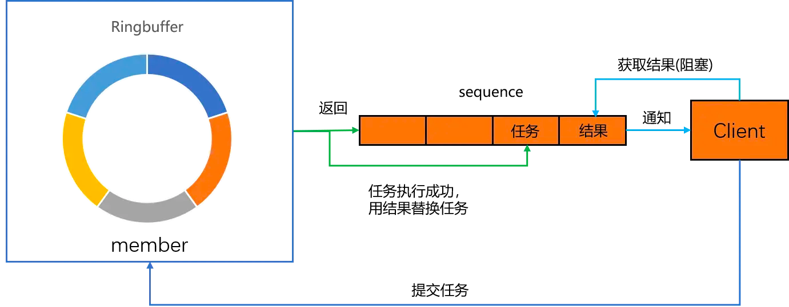

[hazelcast](hazelcast.md)

# 5. 分布式Queue

Hazelcast queue是java.util.concurrent.BlockingQueue
的分布式实现，Hazelcast的queue允许集群所有成员和其交互。使用Hazelcast的分布式queue，可以一个成员添加元素，另外的成员移除元素。

**ItemIDs**: 向queue添加item时，Hazelcast会给每个item分配一个有序递增的itemId 。可以从下面几点理解itemId 的分配行为：

- 一个Hazelcast节点有一个queue，而且queue的备份数至少为1，节点发生重启时，Hazelcast会从重启前已知的最大itemId
  开始分配，不会从最小值开始分配新的itemId 。
- 如果整个集群发生了重启，而且queue设置了持久化数据存储QueueStore ，会使用上述的itemId 分配策略。Hazelcast会使用loadAllKeys
  返回的最大ID开始分配，如果loadAllKeys 没有任何返回值，集群从最小值开始分配。
- itemId 保证在内存和持久存储中无重复。

## 5.1 获取一个队列并向队列添加元素

使用Hazelcast实例的getQueue 获得一个queue，并调用queue的put 方法向队列添加元素。

put(), take(), offer(), poll()

```
HazelcastInstance instance = Hazelcast.newHazelcastInstance();
IQueue<Integer> queue = instance.getQueue("data");
queue.put(1);
Integer item = queue.take();
System.out.println(item);
boolean offerResult = queue.offer(2,1, TimeUnit.SECONDS);
System.out.println(offerResult);
Integer nextItem = queue.poll(1,TimeUnit.SECONDS);
System.out.println(nextItem);
```

集群内所有的操作都满足FIFO的顺序，用户自定义的对象出队和入队都需要序列化。Hazelcast分布式的queue不支持批量变量队列元素。所有的元素都会拷贝到实例本地，实例对queue的遍历都是本地遍历。可以使用ItemListener
监听queue中元素的添加和移除。

## 5.2 创建样例队列

### 5.2.1 生产者生产数据

生产者每1s向队列中添加整数，添加完成后向队列插入-1表示结束：

```java
public class Producer {
    public static void main(String[] args) throws Exception {
        HazelcastInstance instance = Hazelcast.newHazelcastInstance();
        IQueue<Integer> queue = instance.getQueue("data");
        for (int i = 0; i < 100; i++) {
            queue.put(i);
            TimeUnit.SECONDS.sleep(1);
        }
        queue.put(-1);
    }
}
```

### 5.2.2 消费者消费数据

消费者每3s从queue中读取一个数据：

```java
public class FirstConsumer {
    public static void main(String[] args) throws Exception {
        HazelcastInstance instance = Hazelcast.newHazelcastInstance();
        IQueue<Integer> queue = instance.getQueue("data");
        while (true) {
            Integer val = queue.poll();
            System.out.println(val);
            assert val != null;
            if (val.equals(-1)) {
                System.out.println("consume finished");
                break;
            }
            TimeUnit.SECONDS.sleep(3);
        }
    }
}
```

### 5.2.3 平衡生产者和消费者

上面的生产者每1s生产一条数据，消费者每3s消费一条数据，因此队列中的数据会一直增加。为了平衡生产和消费速率的不匹配，需要启动多个消费者来增加消费速度。

```bash
# 启动两个消费者，第一个消费者的输出如下：
0
2
4

# 第二个消费者的输出如下：
1
3
5

```

- 在一个queue有多个生产者和消费的场景，可以使用多个queue解决queue瓶颈问题。
- 使用多queue的场景，发送到多个queue数据的顺序无法保证。
- 因为大多数场景严格的有序并不是那么重要，因此多queue是一个不错的解决方案。

> 从queue读取数据的顺序和数据添加到队列的顺序一致，但是有多个消费者时，这个顺序无法得到保证

## 5.3 设置有界队列

- 有界队列是一个容量受限的队列，当有界队列满时，在元素被移除队列之前任何元素都不能添加到队列中。
- 通过 max-size
  设置容量即可,将 Hazelcast 中的一个分布式队列变为有界队列。max-size 定义了queue 可以存储的最大数据量。
- 当 queue 中的数据量达到该值，put
  操作将会被阻塞，直到 queue 的数据量低于 max-size。

```xml

<hazelcast>
    ...
    <queue name="queue">
        <max-size>10</max-size>
    </queue>
    ...
</hazelcast>
```

## 5.4 持久化queue数据

Hazelcast通过 QueueStore
可以从持久存储中加载数据到queue/queue数据写入持久存储。如果设置了queue存储，向queue添加的数据也会被添加到持久存储中。如果queue中的元素超过了内存限制，接下来添加的元素会存储在持久存储中而不存储在内存中。

QueueStore 提供了store 、storeAll 、load 和delete方法用于存储、加载和删除queue存储在持久存储中的数据。下面是一个简单的QueueStore
实现：

```java
public class SimpleQueueStore implements QueueStore<Item> {

    @Override
    public void delete(Long key) {
        System.out.println("delete");
    }

    @Override
    public void store(Long key, Item value) {
        System.out.println("store");
    }

    @Override
    public void storeAll(Map<Long, Item> map) {
        System.out.println("store all");
    }

    @Override
    public void deleteAll(Collection<Long> keys) {
        System.out.println("deleteAll");
    }

    @Override
    public Item load(Long key) {
        System.out.println("load");
        return null;
    }

    @Override
    public Map<Long, Item> loadAll(Collection<Long> keys) {
        System.out.println("loadALl");
        return null;
    }

    @Override
    public Set<Long> loadAllKeys() {
        System.out.println("loadAllKeys");
        return null;
    }
}
```

```xml
<!--Item 必须支持序列化. 下面是一个queue支持持久存储数据的配置：-->
<hazelcast>
    ...
    <queue name="queue">
        <max-size>10</max-size>
        <queue-store>
            <class-name>com.hazelcast.QueueStoreImpl</class-name>
            <properties>
                <property name="binary">false</property>
                <property name="memory-limit">1000</property>
                <property name="bulk-load">500</property>
            </properties>
        </queue-store>
    </queue>
    ...
</hazelcast>
```

- Binary: 存储格式
- Memory Limit: 存储在queue内存和持久存储中的item数量，超过数量的item将只存储在持久存储中。
- Bulk Load: 批加载大小。

## 5.5 脑裂保护

可以配置在应用queue操作前检查集群最小可用节点数，检查可以避免在网络分区产生的场景下queue的操作可以在所有集群都操作成功。

下面的操作支持脑裂保护检查：

- WRITE, READ_WRITE
    - Collection.addAll()
    - Collection.removeAll(), Collection.retainAll()
    - BlockingQueue.offer(), BlockingQueue.add(), BlockingQueue.put()
    - BlockingQueue.drainTo()
    - IQueue.poll(), Queue.remove(), IQueue.take()
    - BlockingQueue.remove()

- READ, READ_WRITE
    - Collection.clear()
    - Collection.containsAll(), BlockingQueue.contains()
    - Collection.isEmpty()
    - Collection.iterator(), Collection.toArray()
    - Queue.peek(), Queue.element()
    - Collection.size()
    - BlockingQueue.remainingCapacity()

# 6. 分布式MultiMap

Hazelcast中的MultiMap 是一个key可以有多个值的特殊map。和其他数据结构一样，MultiMap 也是分布式和线程安全的。MultiMap 不是
java.util.Map 的分布式实现，MultiMap支持Map的多数功能，但是不支持索引，谓词和加载/存储。MultiMap
的数据最终也会均匀分布于集群所有节点，新节点加入时的处理逻辑和map一样。

## 6.1 基本操作

创建MultiMap 并存储数据：

```
HazelcastInstance instance = Hazelcast.newHazelcastInstance();
MultiMap<String, Integer> multiMap = instance.getMultiMap("data");
multiMap.put("even", 2);
multiMap.put("even", 4);
multiMap.put("odd", 5);
```

遍历元素：

```
HazelcastInstance instance = Hazelcast.newHazelcastInstance();
MultiMap<String, Integer> multiMap = instance.getMultiMap("data");
multiMap.put("even", 2);
multiMap.put("even", 4);
multiMap.put("odd", 5);

multiMap.keySet().forEach(s -> System.out.println(String.format("key = %s,value = %s", s, multiMap.get(s).toString())));
```

输出如下:

```
key = even,value = [4, 2]
key = odd,value = [5]
```

> MultiMap 支持通过 EntryListener 监听数据变化。

## 6.2 配置

在使用MultiMap时，可以通过 valueCollectionType 配置值的集合类型是Set或List。如果选择Set 重复值和空置是不允许的而且顺序是无关紧要的。如果选择使用List
排序是相关的而且可以允许存储重复的值。通过statisticsEnabled 配置可以开启对MultiMap的统计，使用 getLocalMultiMapStats()
方法获取统计信息。

> 目前，MultiMap不支持数据驱逐。

```xml
<!--声明式配置:-->
<hazelcast>
    ...
    <multimap name="default">
        <backup-count>0</backup-count>
        <async-backup-count>1</async-backup-count>
        <value-collection-type>SET</value-collection-type>
        <entry-listeners>
            <entry-listener include-value="false" local="false">com.hazelcast.examples.EntryListener</entry-listener>
        </entry-listeners>
        <!--通过 setSplitBrainProtectionName() 方法或者 -->
        <!-- split-brain-protection-ref 元素配置脑裂保护。-->
        <split-brain-protection-ref>split-brain-protection-name</split-brain-protection-ref>
    </multimap>
    ...
</hazelcast>
```

```
// 代码配置
MultiMapConfig mmConfig = new MultiMapConfig();
mmConfig.setName( "default" )
        .setBackupCount( 0 ).setAsyncBackupCount( 1 )
        .setValueCollectionType( "SET" )
        .setSplitBrainProtectionName( "splitbrainprotectionname" );
```

- backup-count: 同步备份数。
- async-backup-count: 异步备份数。
- statistics-enabled: 是否开启统计。
- value-collection-type: 存储值的集合类型 SET 或 LIST。
- entry-listeners: 监听器.
- split-brain-protection-ref: 脑裂保护。

## 6.3 脑裂保护

MultiMap 和 TransactionalMultiMap 支持配置在应用操作前检查集群可用节点数。在网络分区的情况下，该配置可以避免操作在所有集群（一个集群分为多个）都执行成功。

下面是支持脑裂保护的方法。

- MultiMap:
    - WRITE, READ_WRITE:  
      clear, forceUnlock, lock, put, remove, tryLock, unlock
    - READ, READ_WRITE:  
      containsEntry, containsKey, containsValue, entrySet, get, isLocked, keySet, localKeySet, size, valueCount, values
- TransactionalMultiMap:
    - WRITE, READ_WRITE:  
      put, remove
    - READ, READ_WRITE:  
      size, get, valueCount

# 7. 分布式Set

Hazelcast中的ISet 是java.util.Set 的分布式和并发实现。ISet 拥有以下特性：

- 不允许重复元素。
- 不保证元素顺序。
- 不是分区数据结构。
- 扩容不能超过单节点容量限制。
- 备份数据存储在另外节点的一个分区中。
- 所有数据被拷贝到本地，本地数据遍历。
- 使用对象序列化的字节版本实现相等比较。

## 7.1 基本操作

```
HazelcastInstance instance = Hazelcast.newHazelcastInstance();
ISet<Integer> set = instance.getSet("data");
set.add(1);
set.add(2);
set.add(3);
set.add(1);
System.out.println("set size is " + set.size());
```

输出

```
set size is 3
```

> ISet 可以通过 ItemListener 来监听元素的添加的和移除。

## 7.2 配置

```xml
<!--声明式配置:-->
<hazelcast>
    ...
    <set name="default">
        <backup-count>1</backup-count>
        <async-backup-count>0</async-backup-count>
        <max-size>10</max-size>
        <item-listeners>
            <item-listener>com.hazelcast.examples.ItemListener</item-listener>
        </item-listeners>
        <split-brain-protection-ref>splitbrainprotection-name</split-brain-protection-ref>
    </set>
    ...
</hazelcast>
```

```
Config config = new Config();
CollectionConfig collectionSet = config.getSetConfig("MySet");
collectionSet.setBackupCount(1)
        .setMaxSize(10)
        .setSplitBrainProtectionName("splitbrainprotectionname");
```

- statistics-enabled: 是否开启Set统计信息，默认true。
- backup-count: 同步备份数。
- async-backup-count: 异步备份数。
- max-size: Set存储的最大数据量。
- item-listeners: 监听元素添加和移除的监听器。
- split-brain-protection-ref: 脑裂保护配置。

## 7.3 脑裂保护

ISet &TransactionalSet支持配置在应用操作前检查集群节点最小值，以包装在网络分区发生时，操作不会在所有集群都操作成功。

下面是支持脑裂保护配置的方法：

- ISet:
    - WRITE, READ_WRITE  
      add, addAll, clear, remove, removeAll
    - READ, READ_WRITE  
      contains, containsAll, isEmpty, iterator, size, toArray
- TransactionalSet:
    - WRITE, READ_WRITE  
      add, remove
    - READ, READ_WRITE  
      size

# 8. 分布式List

IList 和ISet 类似，但是IList 支持存储重复元素。

- 支持存储重复元素，能保证元素的顺序。
- 非分区数据结构。
- 容量扩展不能超过单节点容量限制。
- 数据被拷贝到本地，本地遍历。

## 8.1 基本操作

获取一个IList并添加数据，同时使用 ItemListener 监听数据的添加和移除：

```
HazelcastInstance instance = Hazelcast.newHazelcastInstance();
IList<Integer> list = instance.getList("data");
list.addItemListener(new ItemListener<Integer>() {
    @Override
    public void itemAdded(ItemEvent<Integer> itemEvent) {
        System.out.println(itemEvent.getItem() + " added");
    }

    @Override
    public void itemRemoved(ItemEvent<Integer> itemEvent) {
        System.out.println("removed");
    }
},true);
list.add(1);
list.add(2);
list.add(1);
list.remove(2);
```

输出:

```
1 added
2 added
1 added
removed
```

## 8.2 配置

```xml
<!--声明式配置:-->
<hazelcast>
    ...
    <list name="default">
        <backup-count>1</backup-count>
        <async-backup-count>0</async-backup-count>
        <max-size>10</max-size>
        <item-listeners>
            <item-listener>
                com.hazelcast.examples.ItemListener
            </item-listener>
        </item-listeners>
        <!--脑裂保护配置-->
        <split-brain-protection-ref>splitbrainprotection-name</split-brain-protection-ref>
    </list>
    ...
</hazelcast>
```

```
Config config = new Config();
CollectionConfig collectionList = config.getListConfig("MyList");
collectionList.setBackupCount(1)
        .setMaxSize(10)
        // 脑裂保护配置
        .setSplitBrainProtectionName("splitbrainprotectionname");
```

- statistics-enabled: 是否开启List统计信息，默认为true。
- backup-count: 同步备份数。
- async-backup-count: 异步备份数。
- max-size: List存储的最大数据量。
- item-listeners: 元素添加和移除监听器。
- split-brain-protection-ref: 脑裂保护配置。

## 8.3 脑裂保护

IList &TransactionalList支持配置在应用操作前检查集群节点最小值，以包装在网络分区发生时，操作不会在所有集群都操作成功。

下面是支持脑裂保护的方法：

- IList:
    - WRITE, READ_WRITE:  
      add, addAll, clear, remove, removeAll, set
- READ, READ_WRITE:  
  add, contains, containsAll, get, indexOf, isEmpty, iterator, lastIndexOf, listIterator, size, subList, toArray

- TransactionalList:
    - WRITE, READ_WRITE:  
      add, remove
    - READ, READ_WRITE:  
      size

# 9. 主题Topic的Sub/Pub

Hazelcast支持常用的publish/subscribe消息模型。发布和订阅都是集群级操作，一个member订阅主题，其实是订阅了集群内所有member发布到主题的消息，即使member是在订阅之后加入集群。

## 9.1 发布/订阅

```kotlin
// 发布
fun main() = runBlocking {
            val hz: HazelcastInstance = Hazelcast.newHazelcastInstance()
            val topic = hz.getTopic<String>("topic")
            topic.publish("hello")
        }

// 订阅
fun main() = runBlocking<Unit> {
    val hz: HazelcastInstance = Hazelcast.newHazelcastInstance()
    val topic = hz.getTopic<String>("topic")
    topic.addMessageListener(MessageListener {
        println(it.messageObject)
    })
}
```

## 9.2 统计信息

主题两个统计量：

- 当前节点的 发布的消息数
- 当前节点的 接收消息数（member启动之后）
- 注意：统计数据没有备份，如果member下线，统计数据会丢失。

```kotlin
fun main() = runBlocking {
    val hz: HazelcastInstance = Hazelcast.newHazelcastInstance()
    val topic = hz.getTopic<String>("topic")
    topic.publish("hello hazelcast")
    topic.addMessageListener(MessageListener {
        println(it.messageObject)
    })
    println(topic.localTopicStats.publishOperationCount)
    println(topic.localTopicStats.receiveOperationCount)
}
```

## 9.3 理解主题的几个行为

集群的所有成员都有集群内订阅的列表。当一个新成员订阅一个主题时，该成员会向集群所有的成员发送该订阅消息，如果一个新成员加入集群，新成员也会收到目前集群内所有的订阅信息。主题的行为受参数
globalOrderEnabled的影响。

### 9.3.1 消息消费的顺序和发布顺序一致

如果 globalOrderEnabled
设置为false，消息不会被排序，监听器将会按照消息发布的顺序处理消息。

下面举一个简单的例子进行说明。假设集群有三个成员分别是member1，member2和member3，其中member1和member2订阅了主题message，member1依次向主题message发布消息a1，a2，member3依次向主题message发布消息
c1，c2。member1和member2接收到的消息顺序可能是下面的顺序：

- member1 → c1, a1, a2, c2
- member2 → c1, c2, a1, a2

> 即: 只能保证每个 member 发布的消息 按顺序处理，不能保证不同 member 消息之间的处理顺序。

### 9.3.2 所有成员以相同的顺序处理消息

如果globalOrderEnabled 设置为true，监听同一个主题的所有member得到的消息的顺序是一致。上面的例子member1和member2接收消息的顺序将是相同的。

- member1 → a1, c1, a2, c2
- member2 → a1, c1, a2, c2

### 9.3.3 保证生产和发布消息的顺序一致

- 在两种场景下，StripeExecutor
  负责消息的分发和接收。集群所有的事件的生成顺序和发布顺序的一致都是由StripeExecutor保证。
- StripeExecutor中线程的数量由参数hazelcast.event.thread.count配置，默认线程数为5。
- 事件源和线程的映射关系为：hash(
  source's name) % 5。多个事件源可能共享一个线程，因此为了不阻塞其他消息，监听器中不能有太重的处理逻辑，或者可以提交到其他线程异步处理。

## 9.4 配置主题

对于一个主题可以配置：名字，是否收集统计信息，全局有序性和消息监听器。其中有两项参数拥有默认值：

- global-ordering = false,不保证全局有序。
- statistics =true, 收集主题统计信息。

```xml
<!--下面是使用xml对主题进行配置的样例。-->
<hazelcast>
    ...
    <topic name="topic">
        <global-ordering-enabled>true</global-ordering-enabled>
        <statistics-enabled>true</statistics-enabled>
        <message-listeners>
            <message-listener>MessageListenerImpl</message-listener>
        </message-listeners>
    </topic>
    ...
</hazelcast>
```

- statistics-enabled: 是否收集统计信息，默认为true。
- global-ordering-enabled: 是否保证全局有序，默认值false。
- message-listeners: 主题监听器。

除去上面的配置,下面的系统属性也和主题相关，但是不是主题所特有的配置：

- hazelcast.event.queue.capacity 默认值1,000,000
- hazelcast.event.queue.timeout.millis 默认值 250
- hazelcast.event.thread.count 默认值 5

# 10. 可靠主题ReliableTopic

前一片文章中我们介绍了Hazelcast中的主题，但是由于没有数据的备份，主题中的事件可能丢失，为了提高数据可靠性Hazelcast提供了可靠主题。可靠主题也使用ITopic
接口，为了保证数据的可靠性，可靠主题使用Ringbuffer 数据结构备份主题的事件。和普通主题相比，可靠主题有以下优势：

- 主题中的事件不会丢失。RingBuffer 默认有一个同步备份。
- 每个可靠主题使用独立的 RingBuffer，各个主题之间互不影响。
- 在脑裂环境中可靠主题无法工作。

## 10.1 发布/订阅

可靠主题发布事件

```kotlin
import com.hazelcast.core.Hazelcast
import kotlinx.coroutines.runBlocking

fun main() = runBlocking {
    val instance = Hazelcast.newHazelcastInstance()
    val topic = instance.getReliableTopic<Long>("reliable")
    var messageId = 1L
    while (true) {
        topic.publish(messageId)
        messageId++
        kotlinx.coroutines.delay(200L)
    }
}
```

可靠主题的订阅者

```kotlin
import com.hazelcast.core.Hazelcast
import kotlinx.coroutines.runBlocking

fun main() = runBlocking<Unit> {
    val instance = Hazelcast.newHazelcastInstance();
    val topic = instance.getReliableTopic<Long>("reliable")
    topic.addMessageListener {
        println(it.messageObject)
    }
}
```

在创建一个可靠主题时，Hazelcast会为主题自动创建一个Ringbuffer。Ringbuffer的名字和可靠主题的名字相同，可以通过添加一个Ringbuffer配置对可靠主题对应的Ringbuffer进行配置。对于Ringbuffer可以配置容量、主题消息的TTL，设置可以配置持久存储。下面是一个对名字为“reliable”可靠主题使用的Ringbuffer配置的样例：

```xml

<hazelcast>
    ...
    <ringbuffer name="reliable">
        <capacity>1000</capacity>
        <time-to-live-seconds>5</time-to-live-seconds>
    </ringbuffer>
    <reliable-topic name="reliable">
        <topic-overload-policy>BLOCK</topic-overload-policy>
    </reliable-topic>
    ...
</hazelcast>
```

默认，可靠主题使用一个共享的线城池，如果想得到更好的隔离，可以通过 ReliableTopicConfig
配置。Ringbuffer 读是非破坏性的，因此实现批量读更加简单，ITopic 每次最多读取10条数据。

## 10.2 缓慢的消费者

可靠主题提供了对消费速度慢的消费的控制和管理方法。因为不知道速度慢的消费者何时能赶上，因此将对应的事件无限期保存在内存中是不明智的。可以通过Ringbuffer的容量来对内存中的数量进行限制，当
Ringbuffer 存储的数据量超过容量限制，可以选择下面的四种策略进行处理：

- DISCARD_OLDEST: 丢弃老数据，即使设置了TTL。
- DISCARD_NEWEST: 丢弃新数据。
- BLOCK: 阻塞直到有数据过期。
- ERROR: 立即抛出 TopicOverloadException 异常。

## 10.3 配置可靠主题

```xml
<!--声明式配置:-->
<hazelcast>
    ...
    <reliable-topic name="default">
        <statistics-enabled>true</statistics-enabled>
        <message-listeners>
            <message-listener>
                ...
            </message-listener>
        </message-listeners>
        <read-batch-size>10</read-batch-size>
        <topic-overload-policy>BLOCK</topic-overload-policy>
    </reliable-topic>
    ...
</hazelcast>
```

可靠主题的配置参数有以下四项:

- statistics-enabled: 默认值 true，是否开启统计。
- message-listener: 事件监听器。
- read-batch-size: 批量读大小，默认10.
- topic-overload-policy: 事件超过容量限制时的处理策略。

# 11. 分布式事件

如果想感知某些事件，可以向 Hazelcast
实例注册监听器。监听器在集群范围内有效，向集群内的一个成员注册监听器，实际上是向集群内所有的成员注册了监听器。新加入成员产生的事件也会被发送给监听器。Hazelcast只生成注册了监听器的事件。如果没有监听器，也就不会有事件产生，为什么要去做没人关心的事情呢？如果在注册监听器时提供了谓词，事件在发送给监听器时首先要通过谓词，只有通过谓词的事件才能最终发送给监听器。

不宜在监听器内实现过重的处理逻辑（会阻塞线程影响事件的处理）。如若真的需要复杂的处理逻辑，可以使用 ExecutorService 异步执行。

> 注意： 事件并不是高可用的，在故障场景有丢失的风险。但是有一些变通的手段，比如配置容量等可以用来降低事件丢失的可能性。

## 11.1 事件监听器

Hazelcast 提供以下事件监听器:

- 集群事件:
    - Membership Listener: 监听成员事件
    - Distributed Object Listener: 监听分布式对象事件
    - Migration Listener: 监听迁移事件
    - Partition Lost Listener: 监听分区丢失事件
    - Lifecycle Listener: 监听生命周期事件
    - Client Listener: 监听客户端
- 分布式对象事件:
    - Entry Listener: 监听Map、Map分区、MultiMap事件
    - Item Listener: 监听元素事件
    - Message Listener: 监听主题消息事件
- JCache :
    - Cache Entry Listener
    - ICache Partition Lost Listener
- Hazelcast 客户端:
    - Lifecycle Listener
    - Membership Listener
    - Distributed Object Listener

## 11.2 集群事件

1. 实现相关事件监听器的接口，完成监听业务的开发功能。
2. 将监听器注册到Hazelcast的实例对象中。

### 11.2.1 监听成员事件

下面的事件会触发 "成员关系监听器" 的接口方法被调用：

- memberAdded
- memberRemoved
- memberAttributeChanged

```kotlin
// 实现一个成员关系监听器需要实现 MembershipListener 接口。
class ClusterMembershipListener : MembershipListener {
    override fun memberRemoved(event: MembershipEvent?) {
        println(event?.member.toString())
    }

    override fun memberAdded(event: MembershipEvent?) {
        println(event?.member.toString())
    }

    override fun memberAttributeChanged(event: MemberAttributeEvent?) {
        println(event?.member.toString())
    }
}
```

**注册监听器**: 实现监听器类后可以使用 addMembershipListener 方法向 Hazelcast注册监听器：

```kotlin
// 这个方法 创建实例和注册监听之间的事件可能丢失。为了解决这个问题，Hazelcast支持在配置中配置监听器。
val instance = Hazelcast.newHazelcastInstance();
instance.cluster.addMembershipListener(ClusterMembershipListener())
```

```kotlin
// 注册监听器 - 代码配置
val config = Config()
config.addListenerConfig(ListenerConfig("io.github.ctlove0523.hazelcast.data.ClusterMembershipListener"))
val instance = Hazelcast.newHazelcastInstance(config)
```

```xml
<!--注册监听器 - 声明式配置-->
<hazelcast>
    ...
    <listeners>
        <listener>
            io.github.ctlove0523.hazelcast.data.ClusterMembershipListener
        </listener>
    </listeners>
    ...
</hazelcast>
```

```xml
<!--注册监听器 - Spring配置:-->
<hz:listeners>
    <hz:listener class-name="io.github.ctlove0523.hazelcast.data.ClusterMembershipListener"/>
    <hz:listener implementation="MembershipListener"/>
</hz:listeners>
```

### 11.2.2 监听分布式对象事件

当集群内一个分布式对象创建和销毁时，分布式对象监听器的 distributedObjectCreated 和 distributedObjectDestroyed
方法会被调用。

```kotlin
// 实现一个分布式对象监听器需要实现 DistributedObjectListener 接口。
class SimpleListener : DistributedObjectListener {
    override fun distributedObjectCreated(event: DistributedObjectEvent?) {
        println("created ${event?.distributedObject?.toString()}")
    }

    override fun distributedObjectDestroyed(event: DistributedObjectEvent?) {
        println("destroy ${event?.distributedObject?.toString()}")
    }
}
```

```kotlin
// 注册监听器 - 代码配置
val config = Config()
config.addListenerConfig(ListenerConfig("xx.SimpleListener"))
val instance = Hazelcast.newHazelcastInstance(config)
```

```xml
<!--声明式配置-->
<hazelcast>
    ...
    <listeners>
        <listener>
            xx.SimpleListener
        </listener>
    </listeners>
    ...
</hazelcast>
```

```xml
<!--Spring配置-->
<hz:listeners>
    <hz:listener class-name="xx.SimpleListener"/>
    <hz:listener implementation="DistributedObjectListener"/>
</hz:listeners>
```

### 11.2.3 监听迁移事件

下列事件会触发迁移监听器接口方法：

- migrationStarted
- migrationFinished
- replicaMigrationCompleted
- replicaMigrationFailed

```kotlin
// 实现一个迁移监听器类需要实现 MigrationListener 接口：
class SimpleMigrationListener : MigrationListener {
    override fun migrationFailed(p0: MigrationEvent?) {
        println("migration failed ${p0?.status}")
    }

    override fun migrationStarted(p0: MigrationEvent?) {
        println("migration started ${p0?.status}")
    }

    override fun migrationCompleted(p0: MigrationEvent?) {
        println("migration completed ${p0?.status}")
    }
}
```

```kotlin
// 代码配置
val config = Config()
config.addListenerConfig(ListenerConfig("xx.SimpleMigrationListener"))
val instance = Hazelcast.newHazelcastInstance(config)
```

```xml
<!--声明式配置-->
<hazelcast>
    ...
    <listeners>
        <listener>
            xx.SimpleMigrationListener
        </listener>
    </listeners>
    ...
</hazelcast>
```

```xml
<!--Spring配置-->
<hz:listeners>
    <hz:listener class-name="xx.SimpleMigrationListener"/>
    <hz:listener implementation="MigrationListener"/>
</hz:listeners>
```

### 11.2.4 监听分区丢失事件

Hazelcast通过数据多副本提供容错能力。每个分区都有唯一的拥有者，根据配置每个分区会有不同数量的副本拥有者。但是，如果一些成员同时宕机可能导致数据丢失。分区丢失监听器通过分区丢失了多少个副本信息来通知可能发生的数据丢失。每个分区丢失都会创建分区丢失事件。在检测到一个成员崩溃并将其从群集中移除之后，将执行分区丢失检测。
请注意，可能会因网络分区错误而触发错误的 PartitionLostEvent 事件。

```kotlin
// 分区监听器需要实现PartitionLostListener 接口：
class SimplePartitionLostListener : PartitionLostListener {
    override fun partitionLost(p0: PartitionLostEvent?) {
        println("partition lost ${p0?.toString()}")
    }
}
```

集群产生PartitionLostEvent 事件时，分区丢失监听器将会输出 分区ID，丢失的副本索引以及检测到分区丢失的集群成员。

> partition lost com.hazelcast.partition.PartitionLostEvent{partitionId=202, lostBackupCount=0,
> eventSource=[192.168.2.105]:5701}

```kotlin
// 代码配置 方式一 (不推荐)
val config = Config()
config.addListenerConfig(ListenerConfig("xx.SimplePartitionLostListener"))
val instance = Hazelcast.newHazelcastInstance(config)
```

```kotlin
// 代码配置 方式二
val instance = Hazelcast.newHazelcastInstance()
val partitionService = instance.partitionService
partitionService.addPartitionLostListener(SimplePartitionLostListener())
```

```xml
<!--声明式配置-->
<hazelcast>
    ...
    <listeners>
        <listener>
            xx.SimplePartitionLostListener
        </listener>
    </listeners>
    ...
</hazelcast>
```

### 11.2.5 监听生命周期事件

生命周期监听器会收到以下事件的通知：

- STARTING
- STARTED
- SHUTTING_DOWN
- SHUTDOWN
- MERGING
- MERGED
- CLIENT_CONNECTED
- CLIENT_DISCONNECTED

```kotlin
// 实现生命周期监听器需要实现LifecycleListener 接口：
// 生命周期监听器是本地的，只能通知应用所在成员上发生的事件。
class SimpleLifecycleListener : LifecycleListener {
    override fun stateChanged(p0: LifecycleEvent?) {
        println("sate changed ${p0?.toString()}")
    }
}
```

```kotlin
// 代码配置1：
// 注册监听器可能会丢失Hazelcast实例创建和注册监听器之间的事件，更好的方式是使用配置的方式进行注册监听器。
val config = Config()
config.addListenerConfig(ListenerConfig("xxx.SimpleLifecycleListener"))
val instance = Hazelcast.newHazelcastInstance(config)
```

```xml
<!--声明式配置-->
<hazelcast>
    ...
    <listeners>
        <listener>
            xxx.SimpleLifecycleListener
        </listener>
    </listeners>
    ...
</hazelcast>
```

```xml
<!--Spring配置-->
<hz:listeners>
    <hz:listener class-name="xxx.SimpleLifecycleListener"/>
    <hz:listener implementation="LifecycleListener"/>
</hz:listeners>
```

### 11.2.6 监听客户端

集群成员可以使用客户端监听器来感知客户端接入集群和离开集群。客户端的连接和断连只会触发客户连接的节点收到事件，集群的其他成员无法感知。

```kotlin
// 一个简单的客户端监听器：
class SimpleClientListener : ClientListener {
    override fun clientDisconnected(p0: Client?) {
        println("disconnected ${p0?.toString()}")
    }

    override fun clientConnected(p0: Client?) {
        println("connected ${p0?.toString()}")
    }
}
```

```kotlin
// 代码配置 不推荐
val instance = Hazelcast.newHazelcastInstance()
instance.clientService.addClientListener(SimpleClientListener())
```

```xml
<!--声明式配置-->
<hazelcast>
    ...
    <listeners>
        <listener>
            xxx.SimpleClientListener
        </listener>
    </listeners>
    ...
</hazelcast>
```

```xml
<!--Spring配置-->
<hz:listeners>
    <hz:listener class-name="xxx.SimpleClientListener"/>
    <hz:listener implementation="com.yourpackage.ExampleClientListener"/>
</hz:listeners>
```

## 11.3 分布式对象事件

### 11.3.1 监听 Map 事件

使用 MapListener 及其子接口可以监听map操作触发的事件。

如果一个类想捕获Map事件，需要实现目标事件对应的接口，比如 entryAddedListener 和 MapClearedListener。

```kotlin
class SimpleMapListener : EntryAddedListener<String, String> {
    override fun entryAdded(p0: EntryEvent<String, String>?) {
        println("entry added key = ${p0?.key},value = ${p0?.value}")
    }
}

fun main() = runBlocking<Unit> {
    val instance = Hazelcast.newHazelcastInstance()
    val map = instance.getMap<String, String>("map")
    map.addEntryListener(SimpleMapListener(), true)
}
```

创建另一个Hazelcast实例，并向map中添加几个数据，监听器是否能够收到通知：

```kotlin
fun main() = runBlocking<Unit> {
    val instance = Hazelcast.newHazelcastInstance()
    val map = instance.getMap<String, String>("map")
    for (i in 1..3) {
        map["key$i"] = "value$i"
    }
}
```

监听器的输出：

```
entry added key = key1,value = value1
entry added key = key2,value = value2
entry added key = key3,value = value3
```

### 11.3.2 监听 Map 分区丢失

向Hazelcast注册一个MapPartitionLostListener监听器可以监听map分区丢失事件。

```kotlin
class SimpleMapPartitionLostListener : MapPartitionLostListener {
    override fun partitionLost(p0: MapPartitionLostEvent?) {
        println("partition lost ${p0?.toString()}")
    }
}
```

注册监听器

```kotlin
val instance = Hazelcast.newHazelcastInstance()
val map = instance.getMap<String, String>("map")
map.addPartitionLostListener(SimpleMapPartitionLostListener())
```

使用上面的方法注册监听器可能会丢失Hazelcast实例创建和注册监听器之间的事件，更好的方式是使用配置的方式进行注册监听器。

```kotlin
// 代码配置
val config = Config()
config.getMapConfig("map").addMapPartitionLostListenerConfig(MapPartitionLostListenerConfig("xxx.SimpleMapPartitionLostListener"))
```

```xml
<!--声明式配置：-->
<hazelcast>
    ...
    <map name="map">
        <entry-listeners>
            <entry-listener include-value="false" local="false">
                xxx.SimpleMapPartitionLostListener
            </entry-listener>
        </entry-listeners>
    </map>
    ...
</hazelcast>
```

```xml
<!--spring配置-->
<hz:map name="map">
    <hz:entry-listeners>
        <hz:entry-listener include-value="true"
                           class-name="xxx.SimpleMapPartitionLostListener"/>
        <hz:entry-listener implementation="dummyEntryListener" local="true"/>
    </hz:entry-listeners>
</hz:map>
```

Map监听器属性

- include-value ，事件是否包含value，默认true。
- local ,是否只监听本地事件，默认值 false

### 11.3.3 监听 MultiMap 事件

如果要监听MultiMap 产生的事件，需要实现EntryListener接口。

```kotlin
class SimpleEntryListener : EntryListener<String, String> {
    override fun entryEvicted(p0: EntryEvent<String, String>?) {
        println("evicted ${p0?.toString()}")
    }

    override fun entryUpdated(p0: EntryEvent<String, String>?) {
        println("updated ${p0?.toString()}")
    }

    override fun mapCleared(p0: MapEvent?) {
        println("cleared ${p0?.toString()}")
    }

    override fun entryAdded(p0: EntryEvent<String, String>?) {
        println("added ${p0?.toString()}")
    }

    override fun entryRemoved(p0: EntryEvent<String, String>?) {
        println("removed ${p0?.toString()}")
    }

    override fun mapEvicted(p0: MapEvent?) {
        println("evicted ${p0?.toString()}")
    }
}
```

注册监听器

```kotlin
// 代码配置
val config = Config()
val multiMapConfig = config.getMultiMapConfig("map")
multiMapConfig.addEntryListenerConfig(EntryListenerConfig("xxx.SimpleEntryListener", false, false))
val instance = Hazelcast.newHazelcastInstance(config)
```

```xml
<!--声明式配置-->
<hazelcast>
    ...
    <multimap name="map">
        <value-collection-type>SET</value-collection-type>
        <entry-listeners>
            <entry-listener include-value="false" local="false">
                xxx.SimpleEntryListener
            </entry-listener>
        </entry-listeners>
    </multimap>
    ...
</hazelcast>
```

```xml
<!--spring配置-->
<hz:multimap name="map" value-collection-type="SET">
    <hz:entry-listeners>
        <hz:entry-listener include-value="false"
                           class-name="xxx.SimpleEntryListener"/>
        <hz:entry-listener implementation="EntryListener" local="false"/>
    </hz:entry-listeners>
</hz:multimap>
```

MultiMap 监听器属性

- include-value ，事件是否包含value，默认true。
- local ,是否只监听本地事件，默认值 false

### 11.3.4 监听集合队列的元素事件

IQueue, ISet 和IList 接口使用元素监听器。实现一个元素监听器需要实现ItemListener ，添加和删除元素会触发事件。

```kotlin
//简单的监听器
class SimpleItemListener : ItemListener<String> {
    override fun itemRemoved(p0: ItemEvent<String>?) {
        println("item removed ${p0?.toString()}")
    }

    override fun itemAdded(p0: ItemEvent<String>?) {
        println("item added ${p0?.toString()}")
    }
}
```

```kotlin
//代码配置
setConfig.addItemListenerConfig(
        new ItemListenerConfig ("xxx.SimpleItemListener", true) );
```

```xml
<!--声明式配置-->
<hazelcast>
    ...
    <set>
        <item-listeners>
            <item-listener include-value="true">
                xxx.SimpleItemListener
            </item-listener>
        </item-listeners>
    </set>
    ...
</hazelcast>
```

```xml
<!--spring配置-->
<hz:set name="default">
    <hz:item-listeners>
        <hz:item-listener include-value="true"
                          class-name="xxx.SimpleItemListener"/>
    </hz:item-listeners>
</hz:set>
```

元素监听器属性

- include-value：事件是否包含value，默认为true。
- local：是否只监听本地成员事件，默认值为false。

### 11.3.5 监听主题消息事件

ITopic 接口使用消息监听器用来在收到主题对应的消息时通知注册的监听器。实现一个消息监听器需要实现MessageListener 。

```kotlin
class SimpleMessageListener : MessageListener<String> {
    override fun onMessage(p0: Message<String>?) {
        println("get message ${p0?.toString()}")
    }
}
```

注册监听器

```kotlin
//代码配置
val config = Config()
config.getTopicConfig("topic").addMessageListenerConfig(ListenerConfig("xxx.SimpleMessageListener"))
```

```xml
<!--声明式配置-->
<hazelcast>
    ...
    <topic name="default">
        <message-listeners>
            <message-listener>
                xxx.SimpleMessageListener
            </message-listener>
        </message-listeners>
    </topic>
    ...
</hazelcast>
```

```xml
<!--spring配置-->
<hz:topic name="default">
    <hz:message-listeners>
        <hz:message-listener
                class-name="xxx.SimpleMessageListener"/>
    </hz:message-listeners>
</hz:topic>
```

## 11.4 全局事件配置

- hazelcast.event.queue.capacity: 默认值1000000
- hazelcast.event.queue.timeout.millis: 默认值 250
- hazelcast.event.thread.count: 默认值 5

集群成员中的executor控制并调度接收到的事件，同时也负责保证事件的有序性。对于Hazelcast中的所有事件，对于给定的key，可以保证事件生成的顺序和事件发布的顺序一致。对于
map 和 MultiMap 来说，对于同一个key的操作顺序可以保证。对于list，set，topic和queue，事件的顺序和操作的顺序一致。

如果事件队列达到容量限制(hazelcast.event.queue.capacity)
，最后一个事件无法在hazelcast.event.queue.timeout.millis内插入事件队列，这些事件将会被丢弃并发出一个警告信息“EventQueue
overload”。

- 为了实现事件的有序性，StripedExecutor中的每一个线程负责处理事件的一部分。
- 如果监听器执行的计算非常耗时，这有可能导致事件队列达到容量限制并丢失事件。
- 对于map和 MultiMap，可以将hazelcast.event.thread.count配置为更高的值，以减少键冲突，因此，工作线程在StripedExecutor中不会相互阻塞。
- 对于list，set，topic和queue，必须把负载重的工作提交到其他线程中处理。为了保证事件的顺序，在其他线程中应该实现
  StripedExecutor 中同样的逻辑。

# 12. 分布式计算

Hazelcast的四种服务：

- executor service
- durable executor service
- scheduled executor service
- entry processor

## 12.1 Executor Service

ThreadPoolExecutor 是Executor框架的默认实现，它主要为在单JVM内运行而设计。在分布式系统中，ThreadPoolExecutor
可能不是期望的Executor实现，因为提交任务和执行任务的JVM是不同的。

Hazelcast 提供了 IExecutorService 用于在分布式环境中执行异步任务，并且实现了 java.util.concurrent.ExecutorService
接口，为需要计算和数据处理能力的应用程序提供服务。

使用IExecutorService，可以异步执行任务，也可以取消耗时超过预期的任务。因为任务都被分布式执行，因此任务必须支持序列化以支持在不同JVM之间通过网络传输。

Callable 和 Runnable 是 Java Executor 框架实现任务的两种方式：

- Callable: 有返回值
- Runnable: 无返回值

  注意，分布式executor
  service（IExecutorService）倾向在存储数据的JVM中执行。一般来说，Java的Runnable或者Callable不能够在客户端执行，因为客户端不一定都是Java应用。同样，客户端不存储任何数据，因此如果需要客户端必须从服务器获取数据。如果期望连接到服务器的部分或者全部客户端可以运行某些程序，可以通过订阅-推送机制实现：包含运行必须的参数的数据发送到一个ITopic，客户端从ITopic获取数据并执行处理逻辑。

### 12.1.1 实现 Callable Task

实现一个类似java.util.concurrent.Callable 的任务需要实现两个接口：Callable和Serializable。

下面是一个计算IList 全部元素之和的任务：

```kotlin
class ListSumTask : Callable<Long>, Serializable, HazelcastInstanceAware {
    @Transient
    private var instance: HazelcastInstance? = null

    override fun setHazelcastInstance(hazelcastInstance: HazelcastInstance) {
        this.instance = hazelcastInstance
    }

    @Throws(Exception::class)
    override fun call(): Long? {
        val list = instance?.getList<Int>("list")
        var result = 0L
        list?.forEach(Consumer {
            result += it
        })
        return result
    }
}
```

下面是一个简单的Echo 任务，用来检测集群中的哪个成员执行了任务：

```kotlin
class EchoTask(val input: String) : Callable<String>, Serializable, HazelcastInstanceAware {
    @Transient
    private var hazelcastInstance: HazelcastInstance? = null

    override fun setHazelcastInstance(hazelcastInstance: HazelcastInstance) {
        this.hazelcastInstance = hazelcastInstance
    }

    override fun call(): String {
        return hazelcastInstance!!.cluster.localMember.toString() + ":" + input
    }
}
```

**执行 Callable Task**
在 Hazelcast中执行一个 callable task 的执行流程如下：

1. 从 HazelcastInstance 获取 Executor。
2. 提交task并拿到返回值 Future
3. 当任务执行完成，使用 Future 对象获取结果；如果任务未执行完成，执行get() 方法会阻塞当前线程。

> 任务执行过程中不影响程序执行其他任务或逻辑，程序无需显式等待任务执行完成。

下面是执行EchoTask的代码

```kotlin
val instance = Hazelcast.newHazelcastInstance()
val executor = instance.getExecutorService("executor")
val result = executor.submit(EchoTask("echo input"))
println(result.get())
```

### 12.1.2 实现 Runnable Task

和Callable Task类似，Hazelcast中的 Runnable Task 需要实现两个接口：Runnable和Serializable。

一个每秒打印当前时间的Runnable Task：

```kotlin
class TickerTask : Runnable, Serializable {
    override fun run() {
        while (true) {
            println(LocalDateTime.now())
            TimeUnit.SECONDS.sleep(1)
        }
    }
}
```

**执行 Runnable Task**

在 Hazelcast 中执行 Runnable Task 只需要以下两步：

1. 从 HazelcastInstance 获取 Executor
2. 将 task 提交到 Executor

```kotlin
fun main() = runBlocking<Unit> {
    val instance = Hazelcast.newHazelcastInstance()
    val executor = instance.getExecutorService("executor")
    executor.submit(TickerTask())
}
```

### 12.1.3 扩容 Executor Service

Executor service支持水平和垂直扩容。

- 垂直扩容：
    - pool-size
    - CPU
    - 内存
- 水平扩容：
    - 增加 Hazelcast 的数量

### 12.1.4 异步任务指定节点

Hazelcast 的 executor service 是 java.util.concurrent.ExecutorService 的一个分布式实现，允许在 Hazelcast 集群执行代码。
下面通过代码样例来分别说明四种场景：
假设 Hazelcast 集群由两个member节点组成

- 在指定的 member 执行

  ```kotlin
  fun main() = runBlocking<Unit> {
      val instance = Hazelcast.newHazelcastInstance()
      val executor = instance.getExecutorService("default")
      var result: Future<String>? = null
      instance.cluster.members.forEach {
          if (it != instance.cluster.localMember) {
              println("begin to submit task")
              result = executor.submitToMember(EchoTask("test"), it)
          }
      }
      println(result?.get())
  }
  ```

- 在拥有 key 的 member 执行
  ```kotlin
  fun main() = runBlocking<Unit> {
    val instance = Hazelcast.newHazelcastInstance()
    val executor = instance.getExecutorService("default")
    executor.submitToKeyOwner(EchoTask("token"),"token")
  }
  ```
- 随机选择一个 member 执行

  ```kotlin
  fun main() = runBlocking<Unit> {
      val instance = Hazelcast.newHazelcastInstance()
      val executor = instance.getExecutorService("default")
      executor.submit(EchoTask("token"))
  }
  ```

- 在所有 member 执行

  ```kotlin
  fun main() = runBlocking<Unit> {
      val instance = Hazelcast.newHazelcastInstance()
      val executor = instance.getExecutorService("default")
      executor.submitToAllMembers(EchoTask("token"))
  }
  ```

### 12.1.5 取消任务

```kotlin
class TimeCostTask : Callable<String>, Serializable {
    override fun call(): String {
        TimeUnit.SECONDS.sleep(2)
        return "I'm return now"
    }
}

fun main() = runBlocking<Unit> {
    val instance = Hazelcast.newHazelcastInstance()
    val executor = instance.getExecutorService("default")
    val result = executor.submit(TimeCostTask())
    delay(1000L)
    result.cancel(true)
    println(result.isCancelled) // 打印true
}
```

### 12.1.6 任务回调

可以使用 Hazelcast 提供的 ExecutionCallback 实现在任务完成时的异步回调。

- 任务完成且没有错误时回调，需要实现onResponse方法
- 任务完成但是有错误回调，需要实现onFailure 方法。

```kotlin
class CallbackTask : Callable<String>, Serializable {
    override fun call(): String {
        TimeUnit.SECONDS.sleep(10)
        return "callback"
    }
}

class TaskCallback : ExecutionCallback<String> {
    override fun onFailure(t: Throwable?) {
        println("failure ${t?.printStackTrace()}")
    }

    override fun onResponse(response: String?) {
        println("response: $response")
    }
}

fun main() = runBlocking<Unit> {
    val instance = Hazelcast.newHazelcastInstance()
    val executor = instance.getExecutorService("default")
    executor.submit(CallbackTask(), TaskCallback())
}
```

### 12.1.7 为 Task 选择 members

如果想控制执行任务的member，可以使用 MemberSelector 接口，该接口的select(Member) 方法会在每一个 member 上执行已确认当前
member 是否可以执行任务。

```kotlin
class SelfMemberSelector : MemberSelector {
    override fun select(member: Member?): Boolean {
        return member?.getBooleanAttribute("executor")
    }
}
```

Hazelcast 提供了四个默认的 MemberSelector 实例：

1. DATA_MEMBER_SELECTOR
2. LITE_MEMBER_SELECTOR
3. LOCAL_MEMBER_SELECTOR
4. NON_LOCAL_MEMBER_SELECTOR

### 12.1.8 配置 Executor Service

Hazelcast支持对线程池大小，任务队列大小，是否开启统计和脑裂保护进行配置，下面是几种不同的配置方法：

```
// 代码配置
Config config = new Config();
ExecutorConfig executorConfig = config.getExecutorConfig ("exec");
executorConfig.setPoolSize(1).setQueueCapacity(10)
        .setStatisticsEnabled(true)
        .setSplitBrainProtectionName("splitbrainprotectionname");
```

```xml
<!--声明式配置-->
<hazelcast>
    ...
    <executor-service name="exec">
        <pool-size>1</pool-size>
        <queue-capacity>10</queue-capacity>
        <statistics-enabled>true</statistics-enabled>
        <split-brain-protection-ref>splitbrainprotection-name</split-brain-protection-ref>
    </executor-service>
    ...
</hazelcast>
```

### 12.1.9 IExecutorService 脑裂保护

IExecutorService 可以配置在执行操作前检查集群最小可用的member数量，避免在网络分区条件下操作在集群的多数成员成功（实际上数据不可用）。

下面是受脑裂保护的操作：

- execute
- executeOnAllMembers
- executeOnKeyOwner
- executeOnMember
- executeOnMembers
- shutdown
- shutdownNow
- submit
- submitToAllMembers
- submitToKeyOwner
- submitToMember
- submitToMembers

## 12.2 Durable Executor Service

durable executor service是一种将任务存储在执行 member及备份 member，保证在 member 或任务提交者故障的场景中任务不丢失的数据结构。

使用durable executor service 执行任务的步骤：

1. 将任务发送到主分区member及备份member，然后执行任务。
2. 获取任务执行结果。



Hazelcast的executor service返回客户端一个代表任务的Future，durable executor service 执行任务的两个步骤保证了在返回Future
之前任务已经被执行，并且可以使用一个唯一的ID跟踪已提交任务的结果。Hazelcast将任务存储在主备member之后然后执行任务。

第一次调用，Hazelcast 使用 RingBuffer
存储任务并生成一个任务对应的序列返回调用端。通过这种方式，任务可以应对成员失败的情况，并且可以使用ID跟踪任务。第一次调用完成以后，任务的序列就会返回给客户端，第二次调用是从序列中获取任务的执行结果。如果结果已经可用，则将立即返回，否则将一直等待直到收到队列通知。任务执行完成，RingBuffer
会用任务的结果替换序列中的任务，并通知等待在序列上的操作。

### 12.2.1 配置Durable Executor Service

```xml
<!--声明式配置-->
<hazelcast>
    ...
    <durable-executor-service name="myDurableExecSvc">
        <pool-size>8</pool-size>
        <durability>1</durability>
        <capacity>1</capacity>
        <split-brain-protection-ref>splitbrainprotection-name</split-brain-protection-ref>
    </durable-executor-service>
    ...
</hazelcast>
```

```kotlin
// 代码配置
val config = Config()
val durableExecutorConfig = config.getDurableExecutorConfig("durable")
durableExecutorConfig.poolSize = 10
durableExecutorConfig.capacity = 1024
durableExecutorConfig.durability = 1
durableExecutorConfig.splitBrainProtectionName = "brain"
config.durableExecutorConfigs = hashMapOf("durable" to durableExecutorConfig)

val instance = Hazelcast.newHazelcastInstance(config);
val scheduler = instance.getDurableExecutorService("durable")
```

**配置各参数的含义如下**

- name：executor的名字。
- pool-size：executor线程池大小。
- durability：任务备份数，默认值1。
- capacity：Executor 的队列大小
- split-brain-protection-ref：脑裂保护配置的名字

### 12.2.2 脑裂保护

支持脑裂保护的操作：

- WRITE, READ_WRITE:  
  disposeResult, execute, executeOnKeyOwner, retrieveAndDisposeResult, shutdown, shutdownNow, submit, submitToKeyOwner
- READ, READ_WRITE:  
  retrieveResult

## 12.3  Scheduled Executor Service

Hazelcast的scheduled executor service（IScheduledExecutorService）是部分实现了java.util.concurrent.ScheduledExecutorService
接口的数据结构。

部分实现指的是 IScheduledExecutorService 仅支持以固定速率执行任务而不支持以固定间隔执行任务。

IScheduledExecutorService 除去支持通用的调度方法，还支持以下额外的方法：

- scheduleOnMember: 在一个特定的member执行。
- scheduleOnKeyOwner: 拥有key的member执行。
- scheduleOnAllMembers: 在集群所有member执行。
- scheduleOnAllMembers: 在所有给定的member上执行。

**有两种可用模式**

- 可用分区调度，任务存储在主分区和N个备份分区（备份分区数量可配置）。在member故障场景，会有一个或多个备份接管任务。在一个member故障的情况下，任务会被重新分配到主分区的owner，这可能会导致任务延迟。
- 可用member调度，任务只存储在member上，如果member故障任务会丢失。

为每个任务设置唯一标识符或名字是实现任务可靠性的必要条件，首先名字或者ID可以避免任务重复，其次在发起任务的机器或者客户端故障的条件下依然可以通过名字或ID获取任务。实现
NamedTask 可以自定义任务名，如果未定义则使用一个随机的UUID作为名字。通过返回的 IScheduleFuture 可以获取任务的
handler和任务的运行时统计信息。

每一个任务都有一个 Future 与之关联，任务完成可以调用 dispose() 方法释放任务占用的资源。如果任务以固定的速率执行，dispose()
方法可以取消即将执行的任务。任务 handler 是一个用来存储 scheduled future 信息的描述类，使用这些信息可以定位集群中的任务。handler
包括任务的名字，任务的所有者和 scheduler 的名字。

任务被调度执行以后handler就一直处于可用状态，并可以以字符串的形式存储（ScheduledTaskHandler.toUrn()
）并可以从字符串重建handler（ScheduledTaskHandler.of()）。如果handler丢失，可以使用方法获取所有的任务。

和executor service 一样，scheduled executor service 支持有状态任务的调度。有状态任务是在运行时需要任何状态的任务，考虑到分区有可能丢失，任务状态必须与任务一起持久化。可以通过实现
StatefulTask 接口来创建一个有状态任务，实现还需要提供存储和加载状态的方法。如果分区丢失，任务被重新调度并在执行之前需要重新加载之前存储的状态。

### 12.3.1 配置 Scheduled Executor Service

```xml
<!--声明式配置-->
<hazelcast>
    ...
    <scheduled-executor-service name="myScheduledExecSvc">
        <pool-size>16</pool-size>
        <durability>1</durability>
        <capacity>100</capacity>
        <split-brain-protection-ref>splitbrainprotection-name</split-brain-protection-ref>
    </scheduled-executor-service>
    ...
</hazelcast>
```

配置各参数的含义如下：

- name：executor的名字。
- pool-size：executor线程池大小。
- durability：executor的备份数。
- capacity：Executor 的队列大小
- split-brain-protection-ref：脑裂保护配置的名字

### 12.3.2 脑裂保护

IScheduledExecutorService 下面的方法支持脑裂保护:

- WRITE, READ_WRITE:  
  schedule, scheduleAtFixedRate, scheduleOnAllMembers, scheduleOnAllMembersAtFixedRate, scheduleOnKeyOwner,
  scheduleOnKeyOwnerAtFixedRate, scheduleOnMember, scheduleOnMemberAtFixedRate, scheduleOnMembers,
  scheduleOnMembersAtFixedRate, shutdown
- READ, READ_WRITE:  
  getAllScheduledFutures

## 12.4 Entry Processor

Hazelcast 支持 entry 处理。entry processor 是在 map entry 上 **原子执行函数** 的一种方法。

entry processor 是在 IMap 上执行批量处理的一种好的选择。通常的处理方法是使用 IMap.get(key) 获取值修改后再调用 IMap.put(
key,value) 写回 IMap 。如果上述的执行过程在客户端或在没有 key 的 member 中，需要两次网络请求：获取值和修改值并写回 IMap 。

如果你正在执行上面的逻辑，那么你应该考虑一下使用 entry processor。entry processor 在存储数据的 member
上执行数据的读写操作，这避免了上面不必要的两次网络请求。

### 12.4.1 内存中更快的Map操作

entry processor可以内存中执行更快的map操作而无需担心并发问题。entry processor可以处理单个entry也可以处理所有的entry。entry
processor选择entry时支持使用谓词。受益于hazelcast隔离的线程模型（使用分区线程执行处理），使用entry
processor无需现实的锁操作，Hazelcast将entry processor分发到各个成员执行，因此增加成员会提供处理效率。

**使用索引**

entry processor 可以和谓词一起使用，谓词帮助processor选取数据的一个子集进行处理，选取子集可以通过全表扫描也可以通过索引来完成。为了加速算则的过程，可以考虑使用索引，如果map已经创建索引，entry
processor 会自动使用索引。

**使用OBJECT内存格式**

如果entry processor是map的主要操作而且map包含复杂对象，应该考虑使用 OBJECT 的内存格式来减少序列化开销。map默认使用BINARY格式存储值。如果以
OBJECT 格式存储，entry processor可以直接处理，这种场景下没有序列化和反序列化开销。如果有Entry监听器，entry的值还是需要序列化后发送给事件发布服务。

**处理Entries**

IMap 接口提供了以下方法处理entry：

- executeOnKey
- executeOnKeys
- submitToKey
- executeOnEntries
- executeOnEntries

**考虑单key锁**

entry processor 在处理单个key时会使用锁，下面两个方法是用于处理单个 key 的方法：

```kotlin
<R > R executeOnKey (K key, EntryProcessor<K, V, R> entryProcessor);
<R > CompletionStage<R> submitToKey (K key, EntryProcessor<K, V, R> entryProcessor);
```

**处理备份 Entries**

如果代码修改了数据，备份数据也需要修改。这可以减少主备数据不一致。通常情况下这是非常简单的，entry
processor会在主备节点执行。如果希望在备节点执行不同的处理逻辑，需要覆写getBackupProcessor 方法。方法返回一个在备节点执行的EntryProcessor
实例。如果只是读去entry，方法可以返回null，以表示在备节点不执行任何操作。

### 12.4.2 创建Entry Processor

```kotlin
// 创建一个Entry Processor需要实现 EntryProcessor 接口，主备entry都会执行process()
class SimpleEntryProcessor : EntryProcessor<String, Int, Int> {
    override fun process(p0: MutableMap.MutableEntry<String, Int>?): Int? {
        println("old value is ${p0?.value}")
        p0?.setValue(p0.value + 1)
        return p0?.value
    }
}
```

使用实例:

```kotlin
fun main() = runBlocking<Unit> {
    val config = Config()
    val mapConfig = config.getMapConfig("processor")
    mapConfig.backupCount = 1;
    val instance = Hazelcast.newHazelcastInstance(config)
    val map = instance.getMap<String, Int>("processor")
    for (i in 1..10) {
        map["key$i"] = i
    }
    map.executeOnEntries(SimpleEntryProcessor())
}
```

### 12.4.3 Entry Processor 性能优化

默认一个分区线程负责执行entry processor，一个分区线程负责处理一个或多个分区。entry
processor是以假定用户的代码可以在process() 方法内快速执行为前提进行设计。异常情况下process()
方法内的代码非常重执行耗时长，这可能成为处理entry的瓶颈。

Hazelcast提供了慢代码检测器，并可以根据下面的配置记录告警日志：

- hazelcast.slow.operation.detector.enabled (默认值true)
- hazelcast.slow.operation.detector.threshold.millis (默认值: 10000)

Hazelcast默认只检测执行极其缓慢的 processor，但是在开发过程中应该将值设置的更低以检测在生成环境中可能成为瓶颈的processor。下面是Hazelcast提供的优化建议：

- Offloadable 使用executor线程而不是分区线程执行。
- ReadOnly 避免获取key的锁

对于Hazelcast IMDG 3.9版本来说，上面的优化仅适用于IMap 的以下方法：

- executeOnKey(Object, EntryProcessor)
- submitToKey(Object, EntryProcessor)
- submitToKey(Object, EntryProcessor, ExecutionCallback)

**Offloadable Entry Processor**

如果一个entry processor实现了Offloadable() 接口，process() 方法的执行将有getExecutorName()获取的executor执行。

Offloading不阻塞分区线程，并可以让用户从更高的吞吐量受益。在处理期间key将被锁住以避免写冲突。在这种情况下，线程之间的合作关系如下：

1. partition thread 获取entry并锁住key。
2. execution thread 执行processor的process() 方法。
3. partition thread 更新值并解锁ey，如果值没有更新则只解锁key。

Hazelcast已经提供了Offloadable 接口的两个实现

- NO_OFFLOADING: 和没有实现 Offloadable 接口一样。
- OFFLOADABLE_EXECUTOR: 使用默认的 ExecutionService.OFFLOADABLE_EXECUTOR。

如果 getExecutorName() 无法找到executor，将会使用默认的executor。下面是default executor的配置信息：

```xml

<hazelcast>
    ...
    <executor-service name="default">
        <pool-size>16</pool-size>
        <queue-capacity>0</queue-capacity>
    </executor-service>
    ...
</hazelcast>
```

一个名为OffloadedProcessor 的配置如下：

```xml

<hazelcast>
    ...
    <executor-service name="OffloadedInventoryEntryProcessor”>
        <pool-size>30</pool-size>
        <queue-capacity>0</queue-capacity>
    </executor-service>
    ...
</hazelcast>
```

**只读 Entry Processor**

默认如果一个key上有锁entry processor则不会执行，直到key上的锁被释放为止。如果一个entry processor实现了Readonly
接口但是并未实现Offloadable 接口，entry的处理不会委托给其他executor。但是processor也不会感知key上是否有锁，也不会尝试获取key的锁，因为entry
processor不会尝试做任何修改。

如果一个entry processor实现了ReadOnly 接口并尝试修改entry，会抛出 UnsupportedOperationException 异常。

**ReadOnly and Offloadable Entry Processor**

像上面的优化建议那样，如果一个entry processor实现了ReadOnly 和Offloadable 两个接口，processor的process()
方法会在自定义的executor中执行，而且不感知key上的锁也不尝试获取锁。

这种情况线程之间的合作关系如下：

1. partition thread 获取entry
2. execution thread 处理entry

这种情况下EntryProcessor.getBackupProcessor() 比如返回null否则 IllegalArgumentException 异常将会被抛出。修改entry会抛出
UnsupportedOperationException 异常。

```kotlin
class SimpleEntryProcessor : EntryProcessor<String, String, String>, ReadOnly, Offloadable {
    override fun process(p0: MutableMap.MutableEntry<String, String>?): String {
        return p0?.key + p0?.value
    }

    override fun getExecutorName(): String {
        return Offloadable.OFFLOADABLE_EXECUTOR
    }

    override fun getBackupProcessor(): EntryProcessor<String, String, String>? {
        return null
    }
}
```


